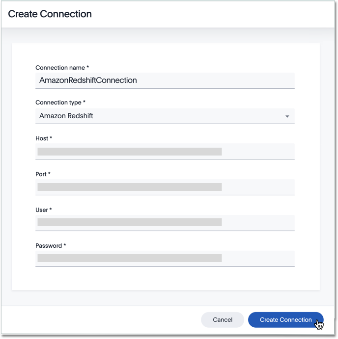

You can add a connection to an Amazon Redshift database using ThoughtSpot DataFlow.

Follow these steps:



4. After you select the Amazon Redshift **Connection type**, the rest of the connection properties appear.

   

     
See the <strong>Create connection</strong> screen for Amazon Redshift

     

      

   

   * [Connection name]({{ site.baseurl }}/data-integrate/dataflow/dataflow-amazon-redshift-reference.html#dataflow-amazon-redshift-conn-connection-name) Name your connection. Mandatory field.
   * [Connection type]({{ site.baseurl }}/data-integrate/dataflow/dataflow-amazon-redshift-reference.html#dataflow-amazon-redshift-conn-connection-type) Choose the Amazon Redshsift connection type. Mandatory field.
   * [Host]({{ site.baseurl }}/data-integrate/dataflow/dataflow-amazon-redshift-reference.html#dataflow-amazon-redshift-conn-host) Specify the hostname or the IP address of the Redshift system Mandatory field.
   * [Port]({{ site.baseurl }}/data-integrate/dataflow/dataflow-amazon-redshift-reference.html#dataflow-amazon-redshift-conn-port) Specify the port associated to the Redshift system Mandatory field.
   * [User]({{ site.baseurl }}/data-integrate/dataflow/dataflow-amazon-redshift-reference.html#dataflow-amazon-redshift-conn-user) Specify the user to connect to Amazon Redshift. This user must have data access privileges. Mandatory field.
   * [Password]({{ site.baseurl }}/data-integrate/dataflow/dataflow-amazon-redshift-reference.html#dataflow-amazon-redshift-conn-password) Specify the password for the User. Mandatory field.
   * [Database]({{ site.baseurl }}/data-integrate/dataflow/dataflow-amazon-redshift-reference.html#dataflow-amazon-redshift-conn-database) Collection of information that is organized so that it can be easily accessed, managed and updated. Mandatory field.

   See [Connection properties]({{ site.baseurl }}/data-integrate/dataflow/dataflow-amazon-redshift-reference.html#connection-properties).

5. Click **Create connection**.   
