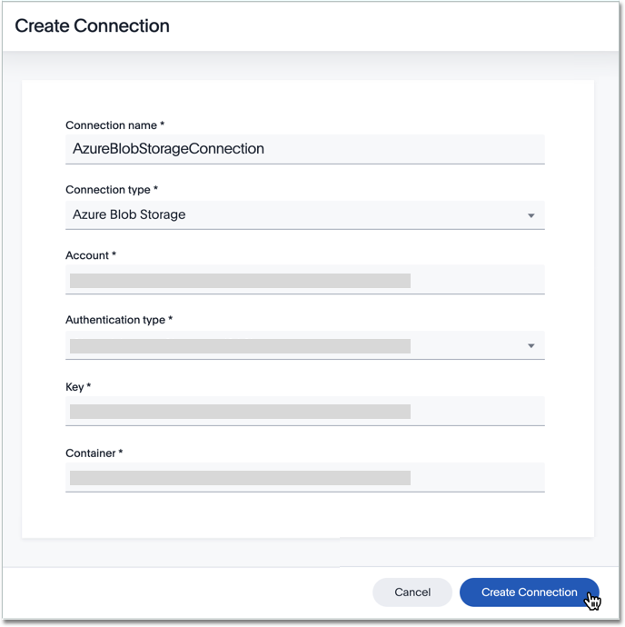

You can add a connection to the Azure Blob Storage file system using ThoughtSpot DataFlow.

Follow these steps:



4. After you select the File **Connection type**, the rest of the connection properties appear.

   

     
See the <strong>Create connection</strong> screen for Azure Blob Storage

     

      

   

   * [Connection name]({{ site.baseurl }}/data-integrate/dataflow/dataflow-azure-blob-storage-reference.html#dataflow-azure-blob-storage-conn-connection-name) Name your connection. Mandatory field.
   * [Connection type]({{ site.baseurl }}/data-integrate/dataflow/dataflow-azure-blob-storage-reference.html#dataflow-azure-blob-storage-conn-connection-type) Choose the Azure Blob Storage connection type. Mandatory field.
   * [Account]({{ site.baseurl }}/data-integrate/dataflow/dataflow-azure-blob-storage-reference.html#dataflow-azure-blob-storage-conn-account) Azure Storage has an address that includes our unique account name which is a combination of the account name and the Azure Storage blob endpoint forms the base address for the objects in your storage account. Mandatory field.
   * [Authentication type]({{ site.baseurl }}/data-integrate/dataflow/dataflow-azure-blob-storage-reference.html#dataflow-azure-blob-storage-conn-authentication-type) This supports two types of authentication methods: Azure account key: Choose to authenticate based on access keys and other parameters to produce an encrypted signature stringthat is passed on the request in the Authorization header.Shared access signatures (SAS): Choose to grant fine-grained access to resources in your storage account with specified permissions and over a specified time interval. Mandatory field.
   * [Key]({{ site.baseurl }}/data-integrate/dataflow/dataflow-azure-blob-storage-reference.html#dataflow-azure-blob-storage-conn-key) The 512-bit access key generated while creating storage account. Mandatory field.
   * [Container]({{ site.baseurl }}/data-integrate/dataflow/dataflow-azure-blob-storage-reference.html#dataflow-azure-blob-storage-conn-container) Give container details that organizes a set of blobs, like a directory in a file system. Mandatory field.

   See [Connection properties]({{ site.baseurl }}/data-integrate/dataflow/dataflow-azure-blob-storage-reference.html#connection-properties).

5. Click **Create connection**.   
