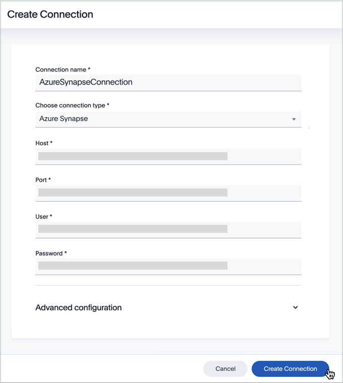

You can add a connection to an Azure Synapse database using ThoughtSpot DataFlow.

To add a new connection to Azure Synapse, follow these steps:



4. After you select the Azure Synapse **Connection type**, the rest of the connection properties appear.

  

     
See the <strong>Create connection</strong> screen for Azure Synapse

     

       

  
  

   * [Connection name]({{ site.baseurl }}/data-integrate/dataflow/dataflow-azure-synapse-reference.html#dataflow-azure-synapse-conn-connection-name) Name your connection. Mandatory field.
   * [Connection type]({{ site.baseurl }}/data-integrate/dataflow/dataflow-azure-synapse-reference.html#dataflow-azure-synapse-conn-connection-type) Choose the Azure Synapse connection type. Mandatory field.
   * [Host]({{ site.baseurl }}/data-integrate/dataflow/dataflow-azure-synapse-reference.html#dataflow-azure-synapse-conn-host) Specify the name of the server. Mandatory field.
   * [Port]({{ site.baseurl }}/data-integrate/dataflow/dataflow-azure-synapse-reference.html#dataflow-azure-synapse-conn-port) Specify the connection port for Azure Synapse. Mandatory field.
   * [User]({{ site.baseurl }}/data-integrate/dataflow/dataflow-azure-synapse-reference.html#dataflow-azure-synapse-conn-user) Specify the user who connects to Azure Synapse. This user must have data access privileges. Mandatory field.
   * [Password]({{ site.baseurl }}/data-integrate/dataflow/dataflow-azure-synapse-reference.html#dataflow-azure-synapse-conn-password) Specify the password. Mandatory field.
   * [JDBC options]({{ site.baseurl }}/data-integrate/dataflow/dataflow-azure-synapse-reference.html#dataflow-azure-synapse-conn-jdbc-options) Specify JDBC URL for connecting to Azure Synapse, and the neccessary options. Optional field.
   * [Database]({{ site.baseurl }}/data-integrate/dataflow/dataflow-azure-synapse-reference.html#dataflow-azure-synapse-conn-database) Specify Database details like name, alias name, schema. Mandatory field.

   See [Connection properties]({{ site.baseurl }}/data-integrate/dataflow/dataflow-azure-synapse-reference.html#connection-properties).

5.  Click **Create connection**.   
