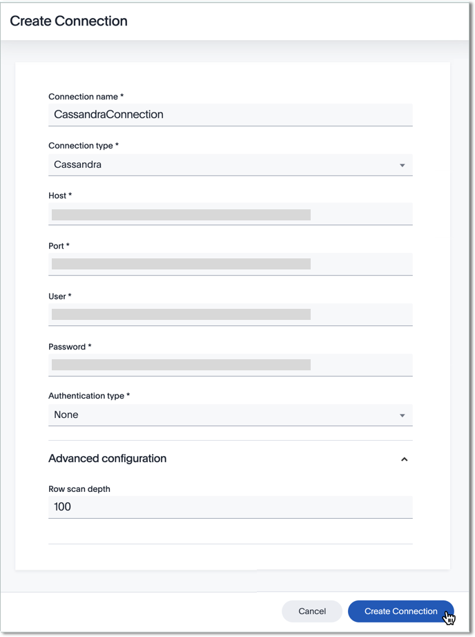
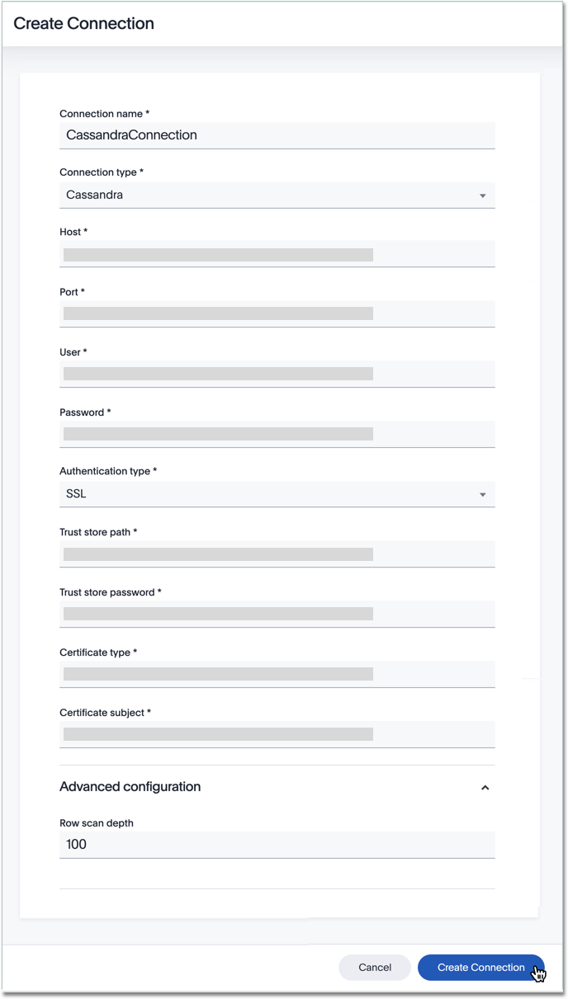
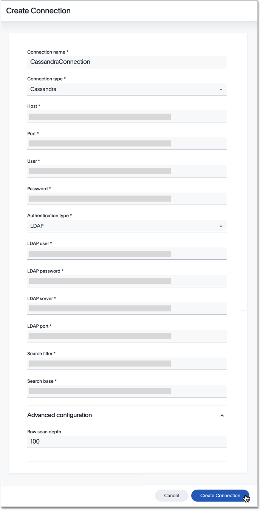
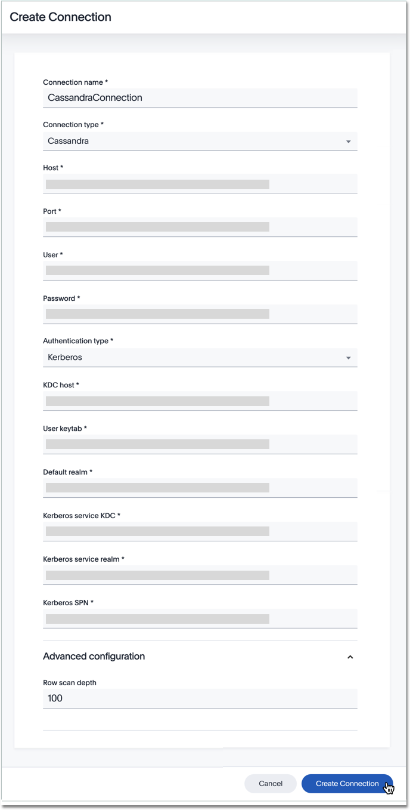

You can add a connection to a Cassandra database using ThoughtSpot DataFlow.

To add a new connection to Snowflake, follow these steps:



4. After you select the Cassandra **Connection type**, the rest of the connection properties appear.

   Depending on your choice of authentication mechanism, you may use different properties.

   

     
Create connection interface for Cassandra, <strong>no authentication</strong>

     

      

   

   

     
Create connection interface for Cassandra, <strong>SSL authentication</strong>

     

      

   
    

   

     
Create connection interface for Cassandra, <strong>LDAP authentication</strong>

     

      

   

   

     
Create connection interface for Cassandra, <strong>Kerberos authentication</strong>

     

      

   

   * [Connection name]({{ site.baseurl }}/data-integrate/dataflow/dataflow-cassandra-reference.html#dataflow-cassandra-conn-connection-name) Name your connection. Mandatory field.
   * [Connection type]({{ site.baseurl }}/data-integrate/dataflow/dataflow-cassandra-reference.html#dataflow-cassandra-conn-connection-type) Choose the Cassandra connection type. Mandatory field.
   * [Host]({{ site.baseurl }}/data-integrate/dataflow/dataflow-cassandra-reference.html#dataflow-cassandra-conn-host) Specify the hostname or the IP address of the Cassandra system Mandatory field.
   * [Port]({{ site.baseurl }}/data-integrate/dataflow/dataflow-cassandra-reference.html#dataflow-cassandra-conn-port) Specify the port associated to the Cassandra system Mandatory field.
   * [User]({{ site.baseurl }}/data-integrate/dataflow/dataflow-cassandra-reference.html#dataflow-cassandra-conn-user) Specify the user to connect to Cassandra. This user must have data access privileges. Mandatory field.
   * [Password]({{ site.baseurl }}/data-integrate/dataflow/dataflow-cassandra-reference.html#dataflow-cassandra-conn-password) Specify the password for the User. Mandatory field.
   * [Authentication]({{ site.baseurl }}/data-integrate/dataflow/dataflow-cassandra-reference.html#dataflow-cassandra-conn-authentication) Specifies the type of security protocol to connect to the instance. Based on the type of security select the authentication type and provide details. Mandatory field.
   * [Row scan depth]({{ site.baseurl }}/data-integrate/dataflow/dataflow-cassandra-reference.html#dataflow-cassandra-conn-row-scan-depth) The maximum number of rows to scan to look for the columns available in a table. Set this property to gain more control over how the provider applies data types to collections. Optional field.
   * [KDC host]({{ site.baseurl }}/data-integrate/dataflow/dataflow-cassandra-reference.html#dataflow-cassandra-conn-kdc-host) Specify KDC Host Name where as KDC (Kerberos Key Distribution Center) is a service than runs on a domain controller server role.  Mandatory field. For Kerberos authentication only.
   * [User keytab]({{ site.baseurl }}/data-integrate/dataflow/dataflow-cassandra-reference.html#dataflow-cassandra-conn-user-keytab) To authenticate via a key-tab you must have supporting key-tab file which is generated by Kerberos Admin and also requires the user principal associated with Key-tab ( Configured while enabling Kerberos) Mandatory field. For Kerberos authentication only.
   * [Default realm]({{ site.baseurl }}/data-integrate/dataflow/dataflow-cassandra-reference.html#dataflow-cassandra-conn-default-realm) A Kerberos realm is the domain over which a Kerberos authentication server has the authority to authenticate a user, host or service.  Mandatory field. For Kerberos authentication only.
   * [Kerberos service KDC]({{ site.baseurl }}/data-integrate/dataflow/dataflow-cassandra-reference.html#dataflow-cassandra-conn-kerberos-service-kdc) Specify the Kerberos KDC of the service. Mandatory field. For Kerberos authentication only.
   * [Kerberos service realm]({{ site.baseurl }}/data-integrate/dataflow/dataflow-cassandra-reference.html#dataflow-cassandra-conn-kerberos-service-realm) Specify the Kerberos realm of the service. Mandatory field. For Kerberos authentication only.
   * [Kerberos SPN]({{ site.baseurl }}/data-integrate/dataflow/dataflow-cassandra-reference.html#dataflow-cassandra-conn-kerberos-spn) Specify the service principal name (SPN) for the Kerberos Domain Controller. Mandatory field. For Kerberos authentication only.
   * [LDAP user]({{ site.baseurl }}/data-integrate/dataflow/dataflow-cassandra-reference.html#dataflow-cassandra-conn-ldap-user) Specify the default LDAP user used to connect to and communicate with the server, it must be set if the LDAP server do not allow anonymous bind. Mandatory field. For LDAP authentication only.
   * [LDAP password]({{ site.baseurl }}/data-integrate/dataflow/dataflow-cassandra-reference.html#dataflow-cassandra-conn-ldap-password) Specify the password for the LDAP User. Mandatory field. For LDAP authentication only.
   * [LDAP server]({{ site.baseurl }}/data-integrate/dataflow/dataflow-cassandra-reference.html#dataflow-cassandra-conn-ldap-server) Specify the host name or IP address of the LDAP server. Mandatory field. For LDAP authentication only.
   * [LDAP port]({{ site.baseurl }}/data-integrate/dataflow/dataflow-cassandra-reference.html#dataflow-cassandra-conn-ldap-port) Specify the port number that is associated to the LDAP server Mandatory field. For LDAP authentication only.
   * [Search filter]({{ site.baseurl }}/data-integrate/dataflow/dataflow-cassandra-reference.html#dataflow-cassandra-conn-search-filter) Specify the search filter for looking up usernames in LDAP. Mandatory field. For LDAP authentication only.
   * [Search base]({{ site.baseurl }}/data-integrate/dataflow/dataflow-cassandra-reference.html#dataflow-cassandra-conn-search-base) Specify the search base for the LDAP server, used to look up users. Mandatory field. For LDAP authentication only.
   * [Trust store path]({{ site.baseurl }}/data-integrate/dataflow/dataflow-cassandra-reference.html#dataflow-cassandra-conn-trust-store-path) Specify the TLS/SSL client certificate store for SSL Client Authentication (2-way SSL) Mandatory field. For SSL authentication only.
   * [Trust store password]({{ site.baseurl }}/data-integrate/dataflow/dataflow-cassandra-reference.html#dataflow-cassandra-conn-trust-store-password) Specify the password for the TLS/SSL client certificate.
    Mandatory field. For SSL authentication only.
   * [Certificate type]({{ site.baseurl }}/data-integrate/dataflow/dataflow-cassandra-reference.html#dataflow-cassandra-conn-certificate-type) Specify the type of key store containing the TLS/SSL client certificate. Mandatory field. For SSL authentication only.
   * [Certificate subject]({{ site.baseurl }}/data-integrate/dataflow/dataflow-cassandra-reference.html#dataflow-cassandra-conn-certificate-subject) Specify the subject of the TLS/SSL client certificate. Mandatory field. For SSL authentication only.

   See [Connection properties]({{ site.baseurl }}/data-integrate/dataflow/dataflow-cassandra-reference.html#connection-properties).

5. Click **Create connection**.   
