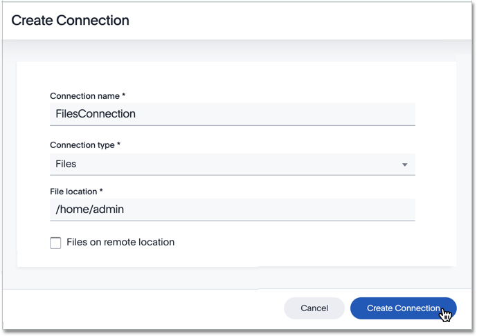
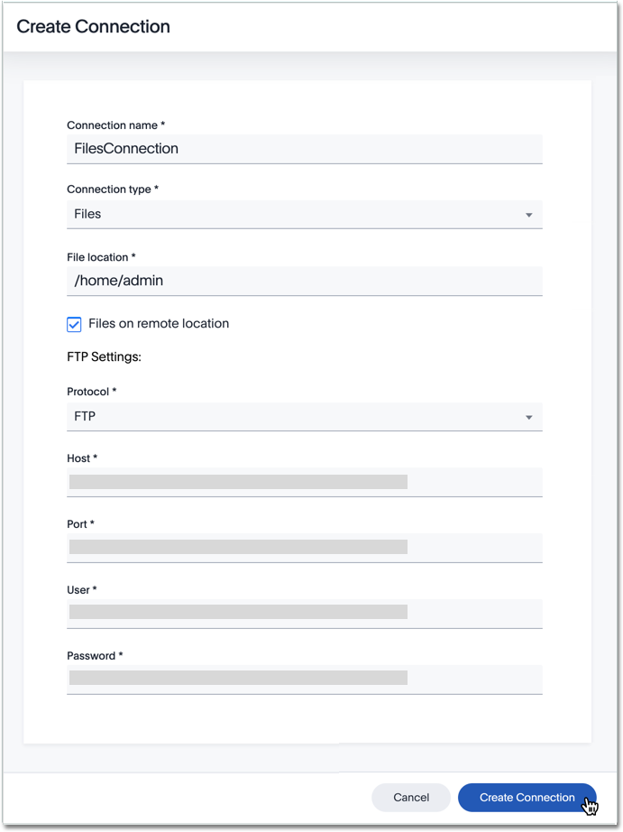
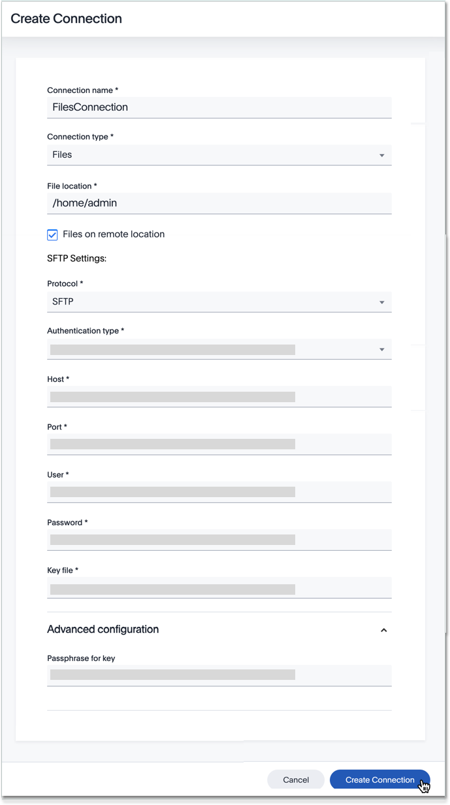

You can add a connection to flat files, both local and remote, using ThoughtSpot DataFlow.

Follow these steps:



4. After you select the File **Connection type**, the rest of the connection properties appear.

   Depending on your choice of authentication mechanism, you may use different properties.

   

     
See the <strong>Create connection</strong> screen for local files

     

      

   

   

     
See the <strong>Create connection</strong> screen for remote files, through <em>FTP</em> connection protocol

     

      

   
    

   

     
See the <strong>Create connection</strong> screen for remote files, through <em>SFTP</em> connection protocol, with <em>key</em> authentication

     

      

   

   

     
See the <strong>Create connection</strong> screen for remote files, through <em>SFTP</em> connection protocol, with <em>password</em> authentication

     

      

   

   * [Connection name]({{ site.baseurl }}/data-integrate/dataflow/dataflow-files-reference.html#dataflow-files-conn-connection-name) Name your connection. Mandatory field.
   * [Connection type]({{ site.baseurl }}/data-integrate/dataflow/dataflow-files-reference.html#dataflow-files-conn-connection-type) Choose the Files connection type. Mandatory field.
   * [File location]({{ site.baseurl }}/data-integrate/dataflow/dataflow-files-reference.html#dataflow-files-conn-file-location) Specify the base location of the file on the server. Mandatory field.
   * [Files on remote location]({{ site.baseurl }}/data-integrate/dataflow/dataflow-files-reference.html#dataflow-files-conn-files-on-remote-location) Specify If the files on remote server. Mandatory field.
   * [Protocol]({{ site.baseurl }}/data-integrate/dataflow/dataflow-files-reference.html#dataflow-files-conn-protocol) Select the required remote server connection Mandatory field. For remote location files only.
   * [Authentication type]({{ site.baseurl }}/data-integrate/dataflow/dataflow-files-reference.html#dataflow-files-conn-authentication-type) Specify the authentication type for SFTP Protocol Mandatory field. For SFTP protocol only
   * [Host]({{ site.baseurl }}/data-integrate/dataflow/dataflow-files-reference.html#dataflow-files-conn-host) Specify the Hostname or the IP address of the remote server Mandatory field. For remote location files only.
   * [Port]({{ site.baseurl }}/data-integrate/dataflow/dataflow-files-reference.html#dataflow-files-conn-port) Specify the Port to connect the remote server Mandatory field. For remote location files only.
   * [User]({{ site.baseurl }}/data-integrate/dataflow/dataflow-files-reference.html#dataflow-files-conn-user) Specify the user to connect to remote server. This user must have data access privileges. Mandatory field. For remote location files only.
   * [Password]({{ site.baseurl }}/data-integrate/dataflow/dataflow-files-reference.html#dataflow-files-conn-password) Specify the password. Optional field. For remote location files only, when using password authentication.
   * [Key file]({{ site.baseurl }}/data-integrate/dataflow/dataflow-files-reference.html#dataflow-files-conn-key-file) Specify the key file and its fully qualified path. Mandatory field. For remote location files only, when using key authentication.
   * [Passphrase for key file]({{ site.baseurl }}/data-integrate/dataflow/dataflow-files-reference.html#dataflow-files-conn-passphrase-for-key-file) Specify the passphrase for the key file. Optional field. For remote location files only, when using key authentication.

   See [Connection properties]({{ site.baseurl }}/data-integrate/dataflow/dataflow-files-reference.html#connection-properties).

5. Click **Create connection**.   
