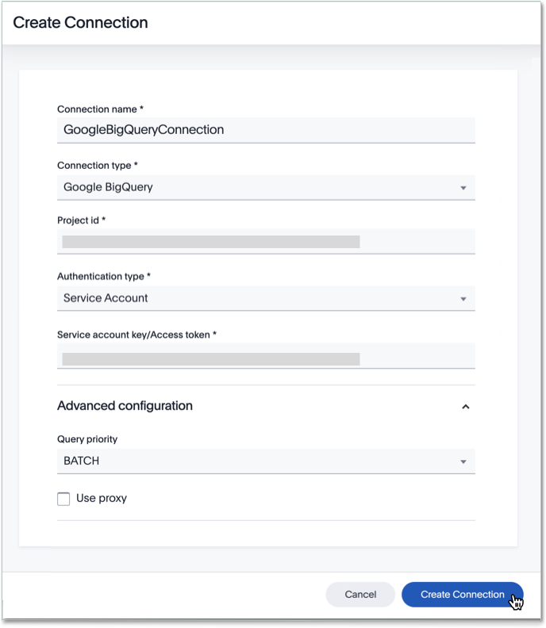
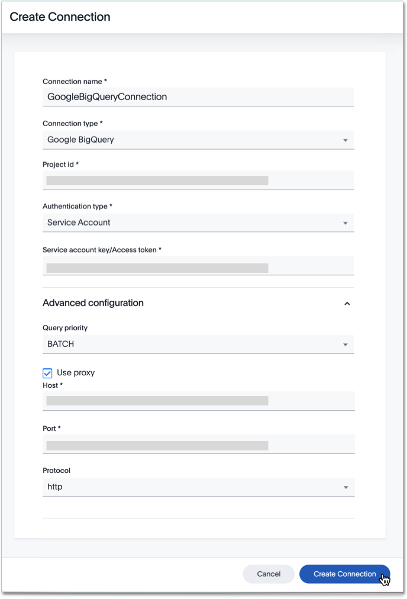

You can add a connection to a Google BigQuery database using ThoughtSpot DataFlow.

Follow these steps:



4. After you select the Google BigQuery **Connection type**, the rest of the connection properties appear.

   Depending on your choice of authentication mechanism, you may use different properties.

   <!--

     
See the <strong>Create connection</strong> screen for Google BigQuery without <em>proxy</em> option

     

      

   

   

     
See the <strong>Create connection</strong> screen for Google BigQuery with <em>proxy</em> option

     

      

   
 -->

   * [Project id]({{ site.baseurl }}/data-integrate/dataflow/dataflow-google-bigquery-reference.html#dataflow-google-bigquery-conn-project-id) The identification number given to particular project and its always unique.
   * [Authentication type]({{ site.baseurl }}/data-integrate/dataflow/dataflow-google-bigquery-reference.html#dataflow-google-bigquery-conn-authentication-type) It can be either Service Account or Access Tokens
   * [Service account key/access Token]({{ site.baseurl }}/data-integrate/dataflow/dataflow-google-bigquery-reference.html#dataflow-google-bigquery-conn-service-account-key/access-token) Provide the Service Account key when authentication type is selected as Service account and token when access token is selected as authentication type.
   * [Query priority]({{ site.baseurl }}/data-integrate/dataflow/dataflow-google-bigquery-reference.html#dataflow-google-bigquery-conn-query-priority) Specify the time duration to run the query and it can be either Interactive or Batch.
   * [Use proxy]({{ site.baseurl }}/data-integrate/dataflow/dataflow-google-bigquery-reference.html#dataflow-google-bigquery-conn-use-proxy) If required, to use a proxy, select the check box Use Proxy and provide the details
   * [Host]({{ site.baseurl }}/data-integrate/dataflow/dataflow-google-bigquery-reference.html#dataflow-google-bigquery-conn-host) Specify the hostname or the IP address of the BigQuery system For proxy authentication only.
   * [Port]({{ site.baseurl }}/data-integrate/dataflow/dataflow-google-bigquery-reference.html#dataflow-google-bigquery-conn-port) Specify the port associated to the BigQuery system For proxy authentication only.
   * [Protocol]({{ site.baseurl }}/data-integrate/dataflow/dataflow-google-bigquery-reference.html#dataflow-google-bigquery-conn-protocol) It can be either http or https For proxy authentication only.
   * [JDBC options]({{ site.baseurl }}/data-integrate/dataflow/dataflow-google-bigquery-reference.html#dataflow-google-bigquery-conn-jdbc-options) Specify the options associated with the JDBC URL.

   See [Connection properties]({{ site.baseurl }}/data-integrate/dataflow/dataflow-google-bigquery-reference.html#connection-properties) for details, defaults, and examples.

5. Click **Create connection**.   
