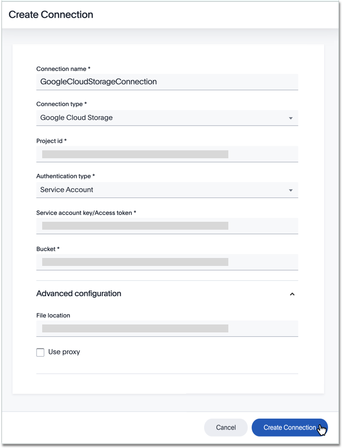
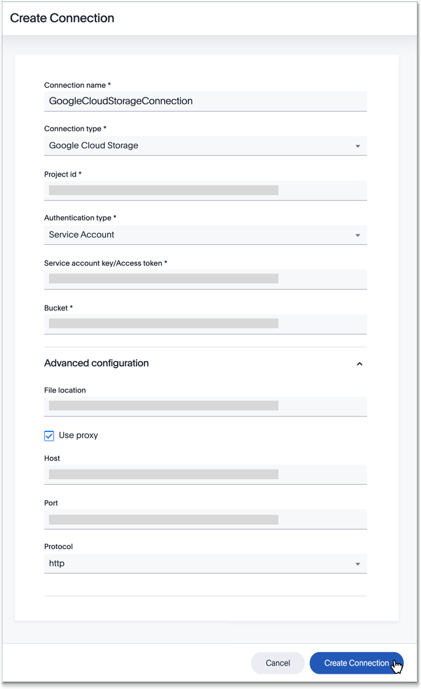

You can add a connection to the Google Cloud Storage file system using ThoughtSpot DataFlow.

Follow these steps:



4. After you select the **Connection type**, the rest of the connection properties appear.

   Depending on your choice of authentication mechanism, you may use different properties.

   <!--

     
See the <strong>Create connection</strong> screen for Google Cloud Storage

     

      

   

   

     
See the <strong>Create connection</strong> screen for Google Cloud Storage with proxy

     

      

    
 -->

    * [Connection name]({{ site.baseurl }}/data-integrate/dataflow/dataflow-google-cloud-storage-reference.html#dataflow-google-cloud-storage-conn-connection-name) Name your connection.
    * [Connection type]({{ site.baseurl }}/data-integrate/dataflow/dataflow-google-cloud-storage-reference.html#dataflow-google-cloud-storage-conn-connection-type) Choose the Google Cloud storage connection type.
    * [Project ID]({{ site.baseurl }}/data-integrate/dataflow/dataflow-google-cloud-storage-reference.html#dataflow-google-cloud-storage-conn-project-id) The identification number given to particular project and its always unique.
    * [Authentication type ]({{ site.baseurl }}/data-integrate/dataflow/dataflow-google-cloud-storage-reference.html#dataflow-google-cloud-storage-conn-authentication-type-) It can be either Service Account or Access Tokens Mandatory field.
    * [Service account key or access token]({{ site.baseurl }}/data-integrate/dataflow/dataflow-google-cloud-storage-reference.html#dataflow-google-cloud-storage-conn-service-account-key-or-access-token) Provide the Service Account key when authentication type is selected as Service account and token when access token is selected as authentication type.
    * [Bucket ]({{ site.baseurl }}/data-integrate/dataflow/dataflow-google-cloud-storage-reference.html#dataflow-google-cloud-storage-conn-bucket-) To specify GCS bucket name Mandatory field.
    * [File location ]({{ site.baseurl }}/data-integrate/dataflow/dataflow-google-cloud-storage-reference.html#dataflow-google-cloud-storage-conn-file-location-) Specify directory of source on agent location Mandatory field.
    * [Use proxy]({{ site.baseurl }}/data-integrate/dataflow/dataflow-google-cloud-storage-reference.html#dataflow-google-cloud-storage-conn-use-proxy) If required, to use a proxy, select the check box Use Proxy and provide the details Optional field.
    * [Host]({{ site.baseurl }}/data-integrate/dataflow/dataflow-google-cloud-storage-reference.html#dataflow-google-cloud-storage-conn-host) Specify the hostname or the IP address of the GCS system Mandatory field. When using proxy authentication only.
    * [Port]({{ site.baseurl }}/data-integrate/dataflow/dataflow-google-cloud-storage-reference.html#dataflow-google-cloud-storage-conn-port) Specify the port associated to the GCS system Mandatory field. When using proxy authentication only.
    * [Protocol]({{ site.baseurl }}/data-integrate/dataflow/dataflow-google-cloud-storage-reference.html#dataflow-google-cloud-storage-conn-protocol) It can be either http or https Mandatory field. When using proxy authentication only.

   See [Connection properties]({{ site.baseurl }}/data-integrate/dataflow/dataflow-google-cloud-storage-reference.html#connection-properties) for details, defaults, and examples.

5. Click **Create connection**.   
