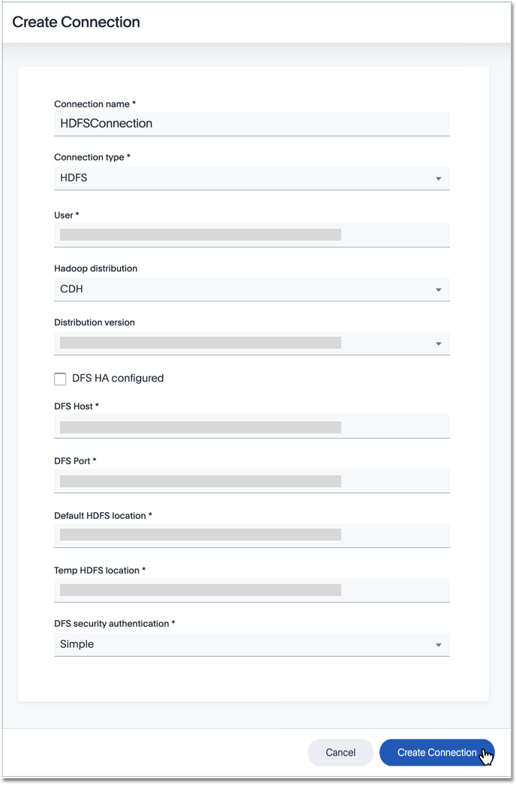
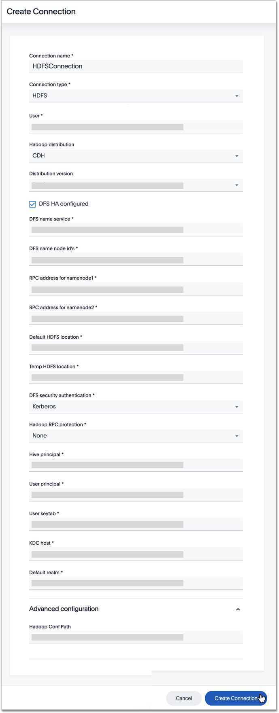

You can add a connection to the HDFS file system using ThoughtSpot DataFlow.

Follow these steps:



4. After you select the File **Connection type**, the rest of the connection properties appear.

   Depending on your choice of authentication mechanism, you may use different properties.

   

     
See the <strong>Create connection</strong> screen for HDFS

     

      

   

   

     
See the <strong>Create connection</strong> screen for HDFS with DFS-HA enabled

     

      

   

   

     
See the <strong>Create connection</strong> screen for HDFS with DFS-HA enabled, and Kerberos authentication

     

      

   

   * [Connection name]({{ site.baseurl }}/data-integrate/dataflow/dataflow-hdfs-reference.html#dataflow-hdfs-conn-connection-name) Name your connection.
   * [Connection type]({{ site.baseurl }}/data-integrate/dataflow/dataflow-hdfs-reference.html#dataflow-hdfs-conn-connection-type) Choose the Google BigQuery connection type.
   * [User]({{ site.baseurl }}/data-integrate/dataflow/dataflow-hdfs-reference.html#dataflow-hdfs-conn-user) Specify the user to connect to HDFS file system. This user must have data access privileges. For Hive security with simple, LDAP, and SSL authentication only.
   * [Hadoop distribution ]({{ site.baseurl }}/data-integrate/dataflow/dataflow-hdfs-reference.html#dataflow-hdfs-conn-hadoop-distribution-) Provide the distribution of Hadoop being connected to Mandatory field.
   * [Distribution version]({{ site.baseurl }}/data-integrate/dataflow/dataflow-hdfs-reference.html#dataflow-hdfs-conn-distribution-version) Provide the version of the Distribution chosen above Mandatory field.
   * [Hadoop conf path]({{ site.baseurl }}/data-integrate/dataflow/dataflow-hdfs-reference.html#dataflow-hdfs-conn-hadoop-conf-path) By default, the system picks the Hadoop configuration files from the HDFS. To override, specify an alternate location. Applies only when using configuration settings that are different from global Hadoop instance settings.
   * [HDFS HA configured]({{ site.baseurl }}/data-integrate/dataflow/dataflow-hdfs-reference.html#dataflow-hdfs-conn-hdfs-ha-configured) Enables High Availability for HDFS Optional field.
   * [HDFS name service]({{ site.baseurl }}/data-integrate/dataflow/dataflow-hdfs-reference.html#dataflow-hdfs-conn-hdfs-name-service) The logical name of given to HDFS nameservice.  Mandatory field. For HDFS HA only.
   "* [HDFS name node IDs]({{ site.baseurl }}/data-integrate/dataflow/dataflow-hdfs-reference.html#dataflow-hdfs-conn-hdfs-name-node-ids) Provides the list of NameNode IDs separted by comma and DataNodes use this property to determine all the NameNodes in the cluster.
   XML property name is <code>dfs.ha.namenodes.<em>dfs.nameservices</em></code>. For HDFS HA only."
   * [RPC address for namenode1]({{ site.baseurl }}/data-integrate/dataflow/dataflow-hdfs-reference.html#dataflow-hdfs-conn-rpc-address-for-namenode1) To specify the fully-qualified RPC address for each listed NameNode and defined as <code>dfs.namenodes.rpc-address.<em>dfs.nameservices</em>.<em>name_node_ID_1></em></code>. For HDFS HA only.
   * [RPC address for namenode2]({{ site.baseurl }}/data-integrate/dataflow/dataflow-hdfs-reference.html#dataflow-hdfs-conn-rpc-address-for-namenode2) To specify the fully-qualified RPC address for each listed NameNode and defined as <code>dfs.namenode.rpc-address.<em>dfs.nameservices</em>.<em>name_node_ID_2</em></code>. For HDFS HA only.
   * [DFS host]({{ site.baseurl }}/data-integrate/dataflow/dataflow-hdfs-reference.html#dataflow-hdfs-conn-dfs-host) Specify the DFS hostname or the IP address Mandatory field. For when <em>not</em> using HDFS HA.
   * [DFS port]({{ site.baseurl }}/data-integrate/dataflow/dataflow-hdfs-reference.html#dataflow-hdfs-conn-dfs-port) Speciffy the associated DFS port Mandatory field. For when <em>not</em> using HDFS HA.
   * [Default HDFS location]({{ site.baseurl }}/data-integrate/dataflow/dataflow-hdfs-reference.html#dataflow-hdfs-conn-default-hdfs-location) Specify the location for the default source/target location Mandatory field.
   * [Temp HDFS location]({{ site.baseurl }}/data-integrate/dataflow/dataflow-hdfs-reference.html#dataflow-hdfs-conn-temp-hdfs-location) Specify the location for creating temp directory Mandatory field.
   * [HDFS security authentication]({{ site.baseurl }}/data-integrate/dataflow/dataflow-hdfs-reference.html#dataflow-hdfs-conn-hdfs-security-authentication) Select the type of security being enabled  Mandatory field.
   * [Hadoop RPC protection]({{ site.baseurl }}/data-integrate/dataflow/dataflow-hdfs-reference.html#dataflow-hdfs-conn-hadoop-rpc-protection) Hadoop cluster administrators control the quality of protection using the configuration parameter hadoop.rpc.protection Mandatory field. For DFS security authentication with Kerberos only.
   * [Hive principal]({{ site.baseurl }}/data-integrate/dataflow/dataflow-hdfs-reference.html#dataflow-hdfs-conn-hive-principal) Principal for authenticating hive services  Mandatory field.
   * [User principal]({{ site.baseurl }}/data-integrate/dataflow/dataflow-hdfs-reference.html#dataflow-hdfs-conn-user-principal) To authenticate via a key-tab you must have supporting key-tab file which is generated by Kerberos Admin and also requires the user principal associated with Key-tab ( Configured while enabling Kerberos) Mandatory field.
   * [User keytab]({{ site.baseurl }}/data-integrate/dataflow/dataflow-hdfs-reference.html#dataflow-hdfs-conn-user-keytab) To authenticate via a key-tab you must have supporting key-tab file which is generated by Kerberos Admin and also requires the user principal associated with Key-tab ( Configured while enabling Kerberos) Mandatory field.
   * [KDC host]({{ site.baseurl }}/data-integrate/dataflow/dataflow-hdfs-reference.html#dataflow-hdfs-conn-kdc-host) Specify KDC Host Name where as KDC (Kerberos Key Distribution Center) is a service than runs on a domain controller server role (Configured from Kerbores configuration-/etc/krb5.conf ) Mandatory field.
   * [Default realm]({{ site.baseurl }}/data-integrate/dataflow/dataflow-hdfs-reference.html#dataflow-hdfs-conn-default-realm) A Kerberos realm is the domain over which a Kerberos authentication server has the authority to authenticate a user, host or service (Configured from Kerbores configuration-/etc/krb5.conf ) Mandatory field.

   See [Connection properties]({{ site.baseurl }}/data-integrate/dataflow/dataflow-hdf-reference.html#connection-properties) for details, defaults, and examples.

5. Click **Create connection**.   
