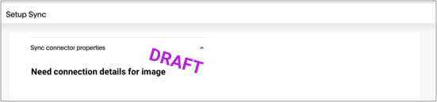

After using ThoughtSpot DataFlow to establish a connection to a MariaDB database, you can create automatic data updates, to seamlessly refresh your data.



4. Specify the sync properties for MariaDB:

   

     
See the <strong>Connection-specific sync properties</strong> screen

     

   

   <!---->

   * [Column delimiter]({{ site.baseurl }}/data-integrate/dataflow/dataflow-mariadb-reference.html#dataflow-mariadb-sync-column-delimiter) Specify the column delimiter character.
   * [Enclosing character]({{ site.baseurl }}/data-integrate/dataflow/dataflow-mariadb-reference.html#dataflow-mariadb-sync-enclosing-character) Specify if the text columns in the source data needs to be enclosed in quotes.
   * [Escape character]({{ site.baseurl }}/data-integrate/dataflow/dataflow-mariadb-reference.html#dataflow-mariadb-sync-escape-character) Specify the escape character if using a text qualifier in the source data.
   * [Fetch size]({{ site.baseurl }}/data-integrate/dataflow/dataflow-mariadb-reference.html#dataflow-mariadb-sync-fetch-size) Specify the number of rows to be fetched at a time and processed in memory. If the value specified is zero then, all rows are extracted at once.
   * [TS load options]({{ site.baseurl }}/data-integrate/dataflow/dataflow-mariadb-reference.html#dataflow-mariadb-sync-ts-load-options) Specify the parameters passed with the <code>tsload</code> command, in addition to the commands already included by the application.

   See [Sync properties]({{ site.baseurl }}/data-integrate/dataflow/dataflow-mariadb-reference.html#sync-properties) for details, defaults, and examples.

5. Save your work by clicking **Save**. Alternatively, click **Save and sync now** to save your work and sync data at the same time.
