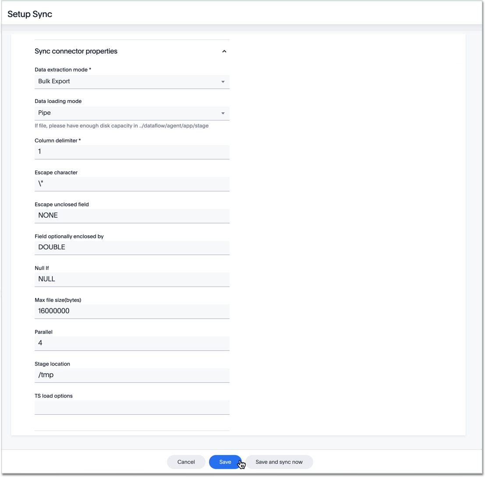

After using ThoughtSpot DataFlow to establish a connection to a Snowflake database, you can create automatic data updates, to seamlessly refresh your data.



4. Specify the sync properties for Snowflake:

   

     
See the <strong>Connection-specific sync properties</strong> screen

     

   * [Data extraction mode]({{ site.baseurl }}/data-integrate/dataflow/dataflow-snowflake-reference.html#dataflow-snowflake-sync-data-extraction-mode) Specify the extraction type.
   * [Column delimiter]({{ site.baseurl }}/data-integrate/dataflow/dataflow-snowflake-reference.html#dataflow-snowflake-sync-column-delimiter) Specify the column delimiter character.
   * [Enclosing character]({{ site.baseurl }}/data-integrate/dataflow/dataflow-snowflake-reference.html#dataflow-snowflake-sync-enclosing-character) Specify if text column data is in quotes, and if  Optional field.
   * [Escape character]({{ site.baseurl }}/data-integrate/dataflow/dataflow-snowflake-reference.html#dataflow-snowflake-sync-escape-character) Specify this if the text qualifier is mentioned. This should be the character which escapes the text qualifier character in the source data.
   * [Escape unclosed field]({{ site.baseurl }}/data-integrate/dataflow/dataflow-snowflake-reference.html#dataflow-snowflake-sync-escape-unclosed-field) Specify this if the text qualifier is mentioned. This should be the character which escapes the text qualifier character in the source data.
   * [Field optionally enclosed by]({{ site.baseurl }}/data-integrate/dataflow/dataflow-snowflake-reference.html#dataflow-snowflake-sync-field-optionally-enclosed-by) Specify if the text columns in the source data needs to be enclosed in quotes.
   * [Null If]({{ site.baseurl }}/data-integrate/dataflow/dataflow-snowflake-reference.html#dataflow-snowflake-sync-null-if) Specify the string literal that indicates NULL value in the extracted data. During data loading, column values that match this string loaded as NULL in the target.
   * [Stage location]({{ site.baseurl }}/data-integrate/dataflow/dataflow-snowflake-reference.html#dataflow-snowflake-sync-stage-location) Specify a temporary staging server Snowflake has to use while DataFlow extracts data.
   * [Max file size]({{ site.baseurl }}/data-integrate/dataflow/dataflow-snowflake-reference.html#dataflow-snowflake-sync-max-file-size) Specify the maximum size of each file in the stage location, in bytes.
   * [Parallel threads]({{ site.baseurl }}/data-integrate/dataflow/dataflow-snowflake-reference.html#dataflow-snowflake-sync-parallel-threads) Specify the number of parallel threads to unload data.
   * [Fetch size]({{ site.baseurl }}/data-integrate/dataflow/dataflow-snowflake-reference.html#dataflow-snowflake-sync-fetch-size) Specify the number of rows fetched into memory at the same time. If the value is 0, system fetches all rows at the same time.
   * [TS load options]({{ site.baseurl }}/data-integrate/dataflow/dataflow-snowflake-reference.html#dataflow-snowflake-sync-ts-load-options) Specify the parameters passed with the <code>tsload</code> command, in addition to the commands already included by the application.

   See [Sync properties]({{ site.baseurl }}/data-integrate/dataflow/dataflow-snowflake-reference.html#sync-properties) for details, defaults, and examples.

5. Save your work by clicking **Save**. Alternatively, click **Save and sync now** to save your work and sync data at the same time.
