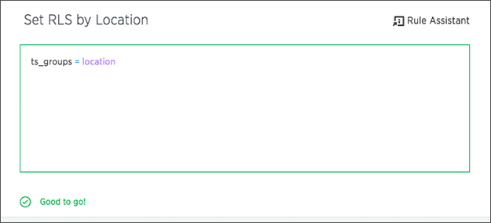

# Define Rule-Based Row Level Security rules

You define row level security by creating an expression that gets evaluated for every row and group combination. This powerful feature can be used with up to thousands of groups.

To define a row level security rule:

1.   [Access the Rule Builder](access_rule_builder.html#). 
2.   Use the Rule Builder window to enter a row security rule. You'll type in an expression, which gets evaluated for every row and group combination. If the rule evaluates to true for a particular row and group, that group will be able to see that row. Use the variable **ts\_groups** to refer to the group name. For example, the expression ts\_groups = location would allow users to only see rows where the value in the location column was the same as their group name.

    Notice how this type of security rule is self-maintaining. If you were to later add additional locations, the rule will still work, as long as users are placed in the group that matches their location.

      

3.   Use formulas if you want to define more complex expressions. You can see a list of available operators by clicking on **Rule Assistant**. 

      

4.   Use the suggestions to build a valid expression. When the expression is valid, you'll see a green indicator at the bottom of the Rule Builder. As you type, you'll see suggestions for formula syntax, variables, and column names. Using these suggestions can make defining an expression easier, particularly when it comes to specific syntax, like enclosing parameters in parenthesis. And if you can't remember the exact column name or variable you want to use, the suggestions can help.
5.   Click **Save**. 
6.   The rule you created will be shown in the list of rules. Click on its name to view or edit the rule. You can also add more rules by clicking **+ Add**. 
7.   To test your rule, create a search that includes the column\(s\) you used in your expression, save it to a pinboard, and share it with all users. Log in as users in different groups, and make sure they are seeing the appropriate rows in the pinboard you created. 

