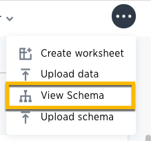
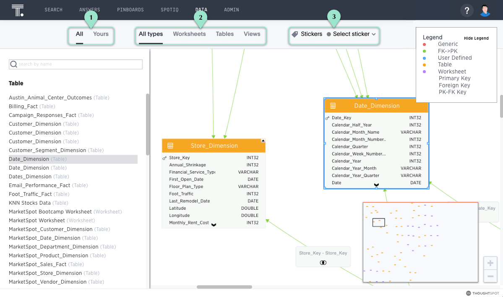
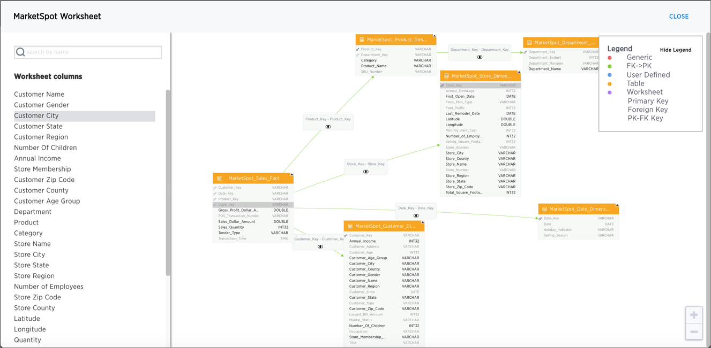

# About the Schema Viewer

There is a schema viewer in ThoughtSpot which lets you see your database schema in the web browser. You can see tables and worksheets and their relationships. The Schema Viewer is interactive, so you can configure it to show just what you want to see.

## Bringing up the Schema Viewer

You can access the Schema Viewer from the **Manage Data** screen by clicking **Actions**, and selecting **View Schema**.

  

When viewing the schema, you can filter the tables shown similarly to how you filter data sources. The list of tables, worksheets, and imported data on the left includes only those objects you want to see. Clicking on one of the objects brings it to the middle of the viewer and highlights it. You can drag the objects around in the viewer.

  

## How to use the Schema Viewer

You can use the Schema Viewer to find out information like:

-   What is the relationship between two tables?
-   What tables make up this worksheet, and how are they joined?

The schema viewer shows joins between tables, join directionality, and join type \(whether they are Foreign Key \> Primary Key, relationship joins, or joins defined by users through the web interface\). Use the **Table** list to find a specific table or worksheet.

## Worksheet view

For worksheets, you can also click on one to view the worksheet. The worksheet view shows the following information:

-   All tables in the worksheet, and the relationships between these tables.
-   Source columns for all columns of a worksheet.

-   Keys and definitions for each relationship, as well as join paths and types.

-   Columns that are derived from formulas.

-   Correct join paths for newly created chasm trap worksheets. Existing chasm trap worksheets will not show the correct join paths.

  

The worksheet view does not work for aggregated worksheets, but does works for worksheets built on top of aggregated worksheets.

