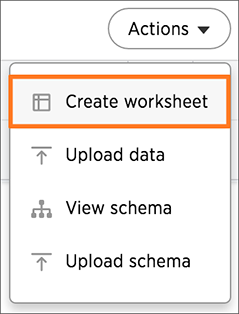

# Create a new worksheet

Create a worksheet to make the data easy for users to search. This process includes adding a new worksheet, after which you will choose the data sources to include in it.

To create a new worksheet:

1.   Click on **Data**, on the top navigation bar. 

      

2.   Click the **Actions** icon from the upper right side of the screen, and select **Create worksheet**. 

    

