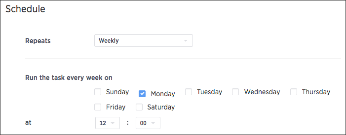

# Schedule a pinboard job

You can schedule a pinboard job for any pinboard by using the Add a schedule prompt page.

You can add multiple schedules with different configurations for a single pinboard. However, each job is limited to one pinboard schedule. In order to add a schedule, you must have administrator or can schedule pinboard privilege, and at least edit-only and view-only access to the pinboard.

To schedule a pinboard:

1.   Log in to ThoughtSpot from a browser. 
2.   Click on **Pinboards**, on the top navigation bar. 

      

3.   Select the pinboard you would like to create a schedule for. 
4.   Click **Actions** and select **Manage schedules** to view all of the schedules set for the pinboard. 

      

5.   Click **New schedule** to add a new pinboard schedule. 

      

6.   On the Add a schedule prompt page, set the times you would like to schedule the pinboard for. 

      

    Scheduled pinboards can be set to repeat every n minutes, hourly, daily, weekly, or monthly. For some of these, you can also choose specific times of the day or days of the week. Make sure to note the Server time zone which is the timezone which will be used.

7.   Enter the name and description of your schedule. Then select whether you'd like to send the pinboard as CSV or PDF attachments. 

      

    CSV files provide all data for tables, with one attachment per table. Use CSV files to perform further analysis offline. PDF files show all visualizations in the pinboard. Each chart takes up a whole page in the file, while only the first 100 rows of a table are included. Use PDF files to skim the data.

8.   Add recipients by entering ThoughtSpot users or groups. Suggestions are shown as you type. Click **Add** to add the selected users or groups. You can also add recipients that are not ThoughtSpot users by entering their email addresses. To do so, you must first set the whitelist domains. Contact ThoughtSpot Support to set your whitelist domains. 

      

    You are limited to 1000 recipients per job.

9.   Click **Schedule** to save your scheduled pinboard. 

**Parent topic:** [About scheduled pinboards](../../admin/manage_jobs/about_scheduled_pinboards.html)

