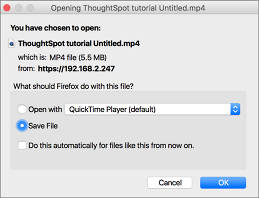

Only administrator users can record the **Replay Search** using the ThoughtSpot application. You can use the recording to create training for your users on how to search your own data.

Recording a search replay requires administrator privileges and a Firefox browser. You must override some of your browser security settings in order to use the ThoughtSpot application to make the recording. This is a one time setup operation. If you do not wish to do this, you can replay the search and record it using QuickTime, Camtasia, or another screencam recording tool.

To record a search replay using ThoughtSpot:

1.   While viewing a chart or table in ThoughtSpot, click the **Replay Search** icon.

     

2.   Click the **Record Replay** button. If you do not see the button, you must log in as a user with administrator privileges.

     

3.   A message will display, showing a URL and a domain or an IP address. Make note of both of these items. Open a new browser tab and go to the URL shown in the message ( for example, "about:config"). Depending on which browser and version you are using, you may need to access the browser configurations through a menu or by typing in a different URL. Check your own browser help section for information on how to access the browser configuration settings, if necessary.

     

4.   You may see a message warning that you are about to override the browser settings. If you trust yourself, click "I'll be careful, I promise!".

     

5. Find the setting for **media.getusermedia.screensharing.allowed_domains**, and add the domain used by ThoughtSpot. This domain will be the same one you made note of from the **Cannot record screen** message.

     

6.   If you see a message asking if you'd like to share your screen with the IP address or domain name of ThoughtSpot, select **Entire screen**.

     

7. When the search replay has been recorded, you'll see a confirmation. Select **Download**.

     

8. Save the recording on your computer by selecting **Save File** and clicking **OK**.

     

**Parent topic:** [System administration](../../admin/system_admin/sysadmin_overview.html)
