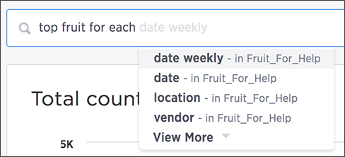

# Search using top keyword

The "top" keyword can be a powerful addition to your search when you remember to use it.

By using one keyword, you can greatly simplify your searches. The top keyword is one such keyword. Its syntax looks like top n for each x.

  

Some common search examples it can simplify are finding the:

-   top two performing sales rep
-   top revenue average revenue by state
-   top two students ranked by scorce for each class

**Parent topic:** [About keyword searches](../../../admin/complex_searches/about_keyword_searches.html)

