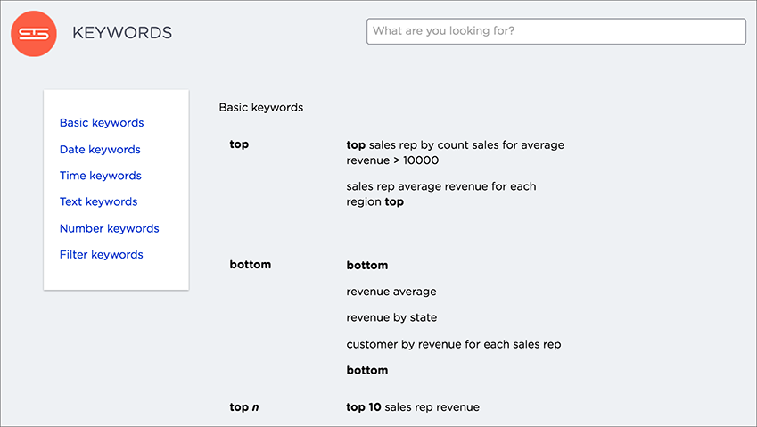

# About keyword searches

Use keywords when asking a question to narrow and further define your search.

In addition to column names, values, and filters, the search bar also accepts keywords. These keywords serve a variety of predefined purposes, and are divided into different groups. The groups are as follows:

-   **Basic keywords**

    You can use keywords such as "top" and "bottom" to, for example, only see results for the best or worst performing sales rep.

-   **Date keywords**

    Date keywords give you the freedom to narrow your search by days, weeks, months, quarters, or years. There are also a number of date related keywords such as "after", "before", and "year-over-year". Use the new date keywords to describe dates in the future. This is useful for exploring things that are scheduled for a future date, such as shipments due to go out in the next week.

-   **Time keywords**

    Time keywords are the most useful when trying to figure out how many visitors you've received within the last "n minutes or hours".

-   **Text keywords**

    You can use text keywords to find similar words or phrases that contains a certain word. For example, `product name contains "green"`.

-   **Number keywords**

    These keywords allows you to define your search by sum, average, count, max, min, and other accumulations.

-   **Filter keywords**

    Filter keywords work in the same way as filters on table columns or chart axes.

-   **Location keywords**

    The keywords "near" and "farther than" allow you to search with spatial filters on your geo type columns with latitude/longitude data. This lets you focus your search based on distance and locations. You can specify a specific radius using miles, kilometers, or meters.

You can access a list of keywords and other reference materials in the [references](../end_user_guide/end_user_reference/keyword_reference.html#) section or in the help center. Open the help center by clicking **Help** on the top navigation bar. Within the help center, you’ll find videos and documentation that pertain to the current version of ThoughtSpot. Here is where you can also find a list of keywords. You can expand each section to see which keywords are available and examples on how to use them.

  

-   **[Search using top keyword](../../admin/advanced_searches_guide/keywords/search_using_top_keyword.html)**  
The "top" keyword can be a powerful addition to your search when you remember to use it.
-   **[Search using growth over time](../../pages/complex_searches/search_using_growth_over_time.html)**  
You can show growth over time by using the "growth of" keyword in your search. This keyword compares the data from different date periods, and returns a percentage of growth.
-   **[Geographical proximity keywords "near" and "farther than"](../../admin/poc_features/model_geo_data_3.4_with_near_and_farther_than.html)**  
The "near" and "farther than" keywords provide proximity searches. If your table contains Latitude and Longitude data, you can use these to do searches that find entities related to each other by location.

**Parent topic:** [About search](../../pages/end_user_guide/end_user_search/search.html)

**Parent topic:** [Advanced searches topics](../../pages/complex_searches/advanced_searches_intro.html)

## Related information  

[Keyword reference](../end_user_guide/end_user_reference/keyword_reference.html#)

