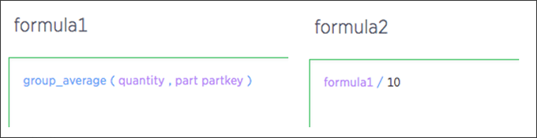

# About nested formulas

Nested formulas, or formula on formula, allow you to reference a formula within another formula.

This feature enables encapsulation and decomposition of formula logic and minimizes duplication by allowing a formula to reuse another formula. These formulas become columns, and are even suggested within the Formula Builder. Invalid formulas, such as cyclic or inconsistent aggregation formulas, are prevented from being created.

In addition, these formulas have dependency awareness, which ensure that you do not break any dependent formulas while editing a formula with dependent formulas. Some common cases of invalidating occur when you try to change a data type. Also, the system does not let you delete a formula that is nested in other formulas.

**Note:** There is no limit to the number of nestings you can create.

  

**Parent topic:** [About formulas in searches](../../pages/complex_searches/add_formula_to_search.html)

