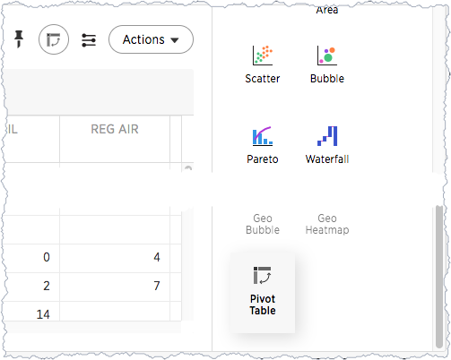
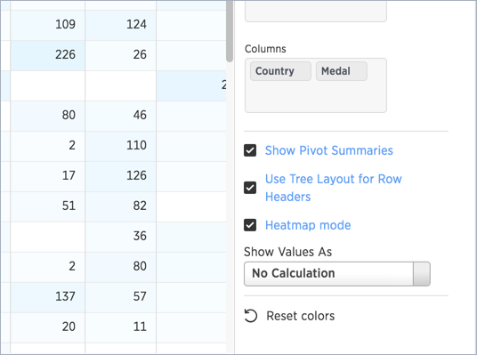

# About pivot tables

Pivot tables in ThoughtSpot use the well known drag-and-drop interface. Creating a pivot table enables exploring alternate visualization of data in a wide table. The basic idea is that some data is easier to consume when laid out horizontally, while others, vertically.

Previously, ThoughtSpot used a pivot keyword to select which fields can be columns and which can be rows, thus moving columns to be rows and vice versa. Now, the pivot table is a chart type.

  

Choose **Pivot Table** under Select Chart Type to view your search as a pivot table. Add rows, measures, and columns to the search bar and restructure your table by moving these values under **Configure Chart**or by dragging and dropping them.

  

Some additional details about pivot tables include:

-   Pivot tables show the grand totals for columns and rows.
-   You can toggle on the Heatmap mode found under Configuration Options to add color coordination to your data.

      

-   Click a column or row to expand it. Additionally, you can expand or collapse all by right clicking the arrow on the top left of a cell.

      

-   When you pin a pivot table to a pinboard, it will retain your expansion settings.

The pivot table chart type has these limitations:

-   Only the first 10,000 data values will be used. If you would like to increase this limit, please contact ThoughtSpot Support.
-   Pivot table is not available if the dataset contains more than 100,000 rows.
-   Columns with cardinality beyond 100 are grouped into \{Other\}.
-   Show underlying data menu is unavailable.
-   Conditional formatting is not functional.

**Parent topic:** [About chart types](../../pages/end_user_guide/end_user_search/about_chart_types.html)

**Parent topic:** [Advanced searches topics](../../pages/complex_searches/advanced_searches_intro.html)

