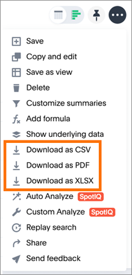
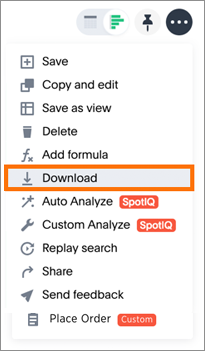

# Download your search

You can download your search as either a table or chart.

You have the option to download your table as a CSV (comma separated values), PDF, or XLSX (Excel) file. When you download a chart, it will be a PNG file.

To download your search:

1.   Click **Actions**. For a table, choose between **Download as CSV**, **Download as PDF**, or **Download as XLSX**.

      

     For a chart, select **Download**.

      

**Parent topic:** [Other search actions](../../pages/complex_searches/search_actions.html)

