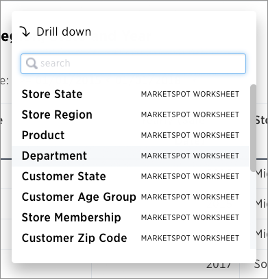

# Drill down

Drilling down allows you to see more information about the columns used within your search.

To drill down:

1.   Right click on the visualization or table cell of interest, and select **Drill down**. 

      

2.   Click on any of the listed data to recreate the search with that data included. 

      

**Parent topic:** [Other search actions](../../pages/complex_searches/search_actions.html)

