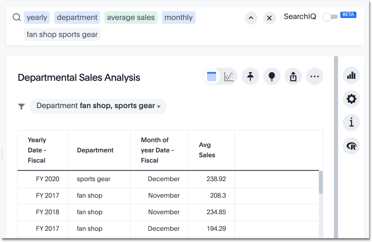
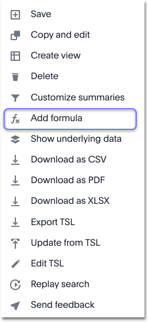
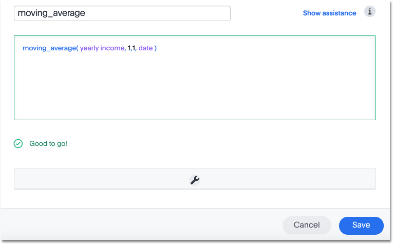
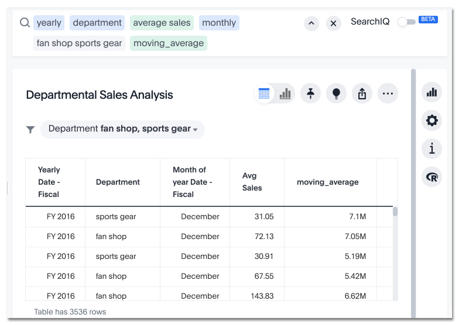

# Calculate the moving average

You can use the moving formulas to compute a measure within a moving window of your data, usually defined by time.

This example will demonstrate using the moving\_average formula. To use the moving function in a search:

1.   Start a new search. 

      

2.   In the upper right hand side of the table, click **Actions** and select **Add formula**. 

      

3.   Enter the moving\_average formula, providing a measure, a window, and one or more attributes. The example will return the average of revenue, within the commit date window size of 3. The window includes the previous, current, and next rows. The attributes are the ordering columns used to compute the moving average. The window is (current - Num1...Current + Num2) with both end points being included in the window. For example, "1,1" will have a window size of 3. To see periods in the past, use a negative number for the second endpoint, as in the example "moving\_average(sales, 1, -1, date)".

      

4.   Name the formula by clicking on its title and typing the new name. Click **Save**. 
5.   The formula will appear in the search bar and in the table as its own column. 

      

    A box displaying the moving average within the entire table will appear at the bottom. You can click on it to toggle between aggregation types.

**Parent topic:** [About moving formulas](../../pages/complex_searches/about_moving_formulas.html)

