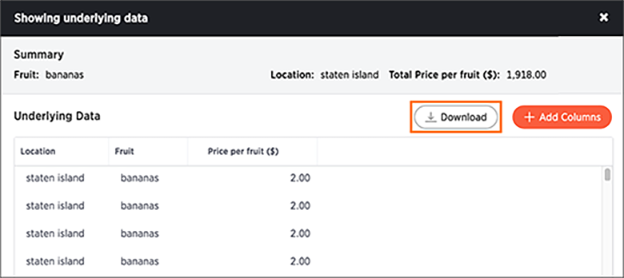
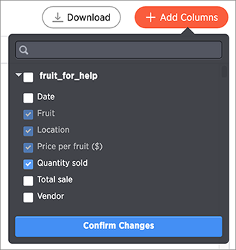

# Show underlying data

Viewing the underlying data of your answer gives you an un-aggregated view of the underlying data.

You can see the most granular details of a given result set, i.e. it shows the un-aggregated view. This feature lets you understand what an answer consists of. For example, if you search for "customer region revenue", the answer shows the aggregate revenue value for each customer region. You can then click on any row and then on **Show underlying data**, to see each value that "revenue" constitutes of, for any given region.

Only the first 1,000 rows are shown when viewing the underlying data. You can even download the results shown when you choose **Show underlying data** from a chart. The download file limit is 100,000 rows.

**Note:** Viewing underlying data does not work for answers that are derived from chasm trap searches.

To show underlying data:

1.   Right click on the visualization or table cell of interest, and select **Show underlying data**. 

      

    A new window will open, displaying a summary and the underlying data.

2.   Click **Download** to download a CSV file of the data. 

      

3.   Click **+ Add Column** to add more columns. After selecting columns to add, click **Confirm Changes**. 

      

**Parent topic:** [Other search actions](../../pages/complex_searches/search_actions.html)

