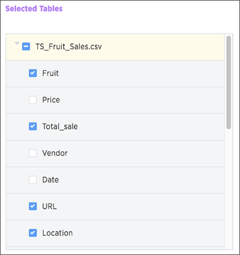

# Add/remove columns in a loaded table

You can modify tables that have been selected for load in Data Connect by adding or removing columns.

In addition to adding more tables while editing a data source, you can also add or remove columns from loaded tables. This makes it easier to include new source columns with your job, edit the data source definition to add or remove columns, and adapt existing jobs to change source schemas.

All relationships are captured with this feature. The relationships are automatically created for you when you add a primary key column.

It is recommended that you do not edit the schema when altering tables.

To add/remove columns in a loaded table:

1.   While viewing the **Selected Tables** section of the **Select Tables** step, expand one or more tables. 

      

2.   Click the checkboxes to select/deselect tables columns for import. 

    **Note:** You cannot deselect all columns and tables in the job.

3.   Click **Next** and complete the import. 

**Parent topic:** [About making changes to Data Connect setup](../../../data_connect/data_connect/making_changes/about_changing_etl_jobs.html)

