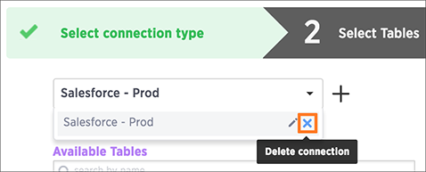

# Delete a connection

You can delete a connection, but only once you've resolved each of its dependencies.

A connection is not tied to a task, and can therefore be called in multiple data sources. So in order to delete a connection, you must first delete all of the sources and tasks that use that connection. Once the connection is not used in any data source, you will be able to delete it.

To delete a connection:

1.   [Log in to ThoughtSpot from a browser.](../../../admin/setup/accessing.html#) 
2.   Click on **Data**, on the top navigation bar. 

      

3.  Click the **Data Sources** tab at the top of the screen.

    

4.   Delete any dependent data sources. To delete a data source, see [Delete a data source](delete_data_source.html#).
5.   Select **+ New data source** on the upper right hand side of the panel. 

      

6.   Select the connection type of interest and click **Next**. 

      

7.   In the **Select Tables** step, click the **Select a connection** dropdown and browse the list for the connection you wish to delete. 

    1.   Click the **x** on the right of your selected connection to delete it. 
      

**Parent topic:** [About making changes to Data Connect setup](../../../data_connect/data_connect/making_changes/about_changing_etl_jobs.html)

