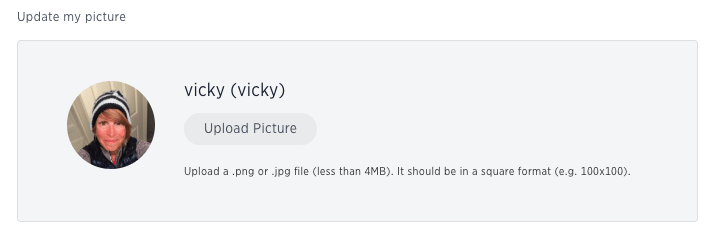
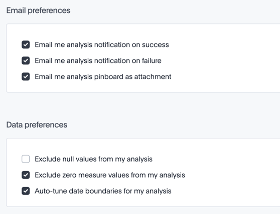

# About the user profile

The user icon lets you view your profile or sign out of ThoughtSpot.

To view the user actions, click on your user icon on the top right corner of the page.

  

Click **Profile** to go to your profile preference page, where you can change your icon and email preferences.

You can change your picture by clicking **Upload Picture**. The system accepts PNG or JPEG files that are under 4MB.

  

You can change your email notifications preferences by checking or unchecking **Email me sharing notifications** and clicking **Update Preferences**.

  

Clicking **Sign out** logs you out of ThoughtSpot, and takes you back to the sign in page.

**Parent topic:** [Introduction](../../../pages/end_user_guide/end_user_introduction/introduction.html)

