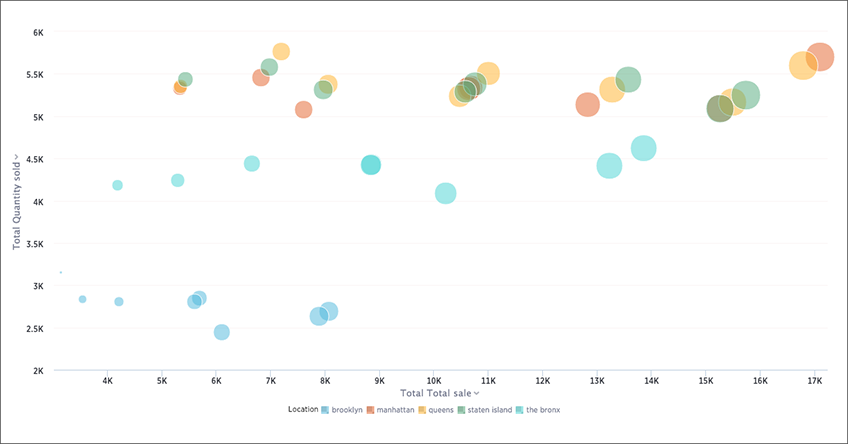
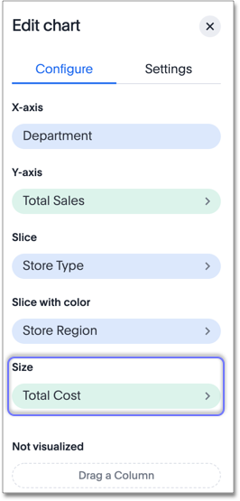

# Bubble charts

The bubble chart displays three dimensions of data with each containing a set of values.

The bubble chart is a variation of the scatter chart, with the data points replaced with bubbles. These bubbles add a third data dimension to your answer.

  

The size of each bubble depends on the measure you choose under **Edit chart configuration**.

  

Your search needs at least one attribute and two measures to be represented as a bubble chart.

**Parent topic:** [About chart types](../../../pages/end_user_guide/end_user_search/about_chart_types.html)

