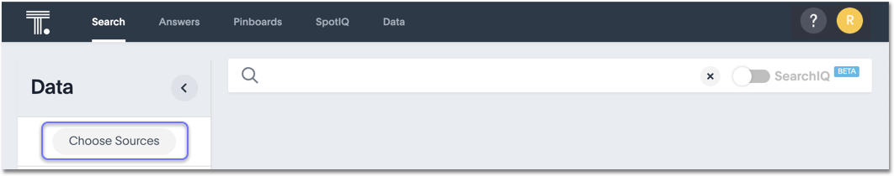

# About choosing sources

Before you start a new search, make sure you have chosen the right data sources.

To begin a new search, you must first select your data sources by clicking on the **Choose Sources** button. You will see a list of data sources that have been shared with you. The data sources are usually created by your administrator, though you can also [upload your own data](../../loading/load_from_web_browserdita.html#).

  

Searches happen in the context of the selected data sources. ThoughtSpot will also make suggestions from other data sources for you, if what you're typing can't be found in the selected data source.

**Parent topic:** [About starting a new search](../../../pages/end_user_guide/end_user_search/about_starting_a_new_search.html)

