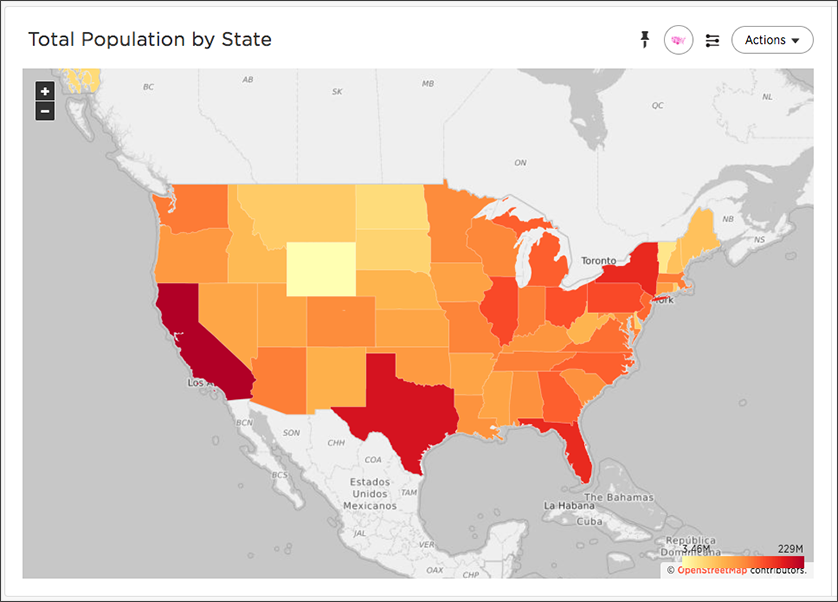

# Geo area charts

The geo area chart displays country, county, state and zipcode data on a geographical chart.

Geo area charts highlight the regions of interest. Point data (longitude/latitude) doesn't work on geo area charts. Also, only geo area charts display boundaries for counties.

  

Your search needs one geographical column of granularity to be represented as a geo area chart.

**Parent topic:** [About geo charts](../../../pages/end_user_guide/end_user_search/about_geo_charts.html)

