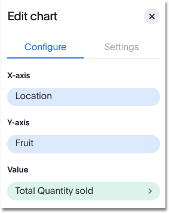

# Heatmap charts

The heatmap chart displays individual data values in a matrix following a color scale.

Heatmap charts are similar to treemap charts in that they both use a similar system of color-coding to represent data values. However, the heatmap does not use size to measure data, and instead requires an additional attribute.

  

The value of each cell depends on the measure you choose under **Edit char configuration**.

  

Your search needs at least two attributes and one measure to be represented as a heatmap chart.

**Parent topic:** [About chart types](../../../pages/end_user_guide/end_user_search/about_chart_types.html)

