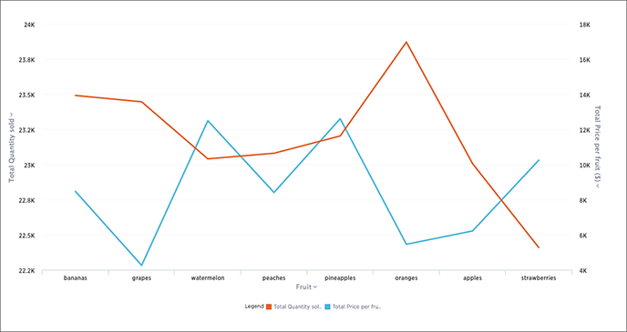

# Line charts

Like the column chart, the line chart is one of ThoughtSpot's simplest, yet most versatile chart type. More often than not the line chart will be chosen as your default chart type.

Line charts displays your data as a series of data points connected by straight line segments. The measurement points are ordered by the x-axis value. Line charts are good at showing trends over intervals of time.

  

Your search needs at least one attribute and one measure to be represented as a line chart.

**Parent topic:** [About chart types](../../../pages/end_user_guide/end_user_search/about_chart_types.html)

