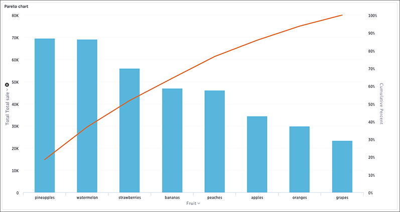

# Pareto charts

The pareto chart is a type of chart that contains both columns and a special type of line chart.

The individual values of a pareto chart are represented in descending order by columns, and the cumulative percent total is represented by the line. The y-axis on the left is paired with the columns, while the y-axis on the right is paired with the line. By the end of the line, the cumulative percent total reaches 100 percent.

  

Your search needs at least one attribute and one measure to be represented as a pareto chart.

**Parent topic:** [About chart types](../../../pages/end_user_guide/end_user_search/about_chart_types.html)

