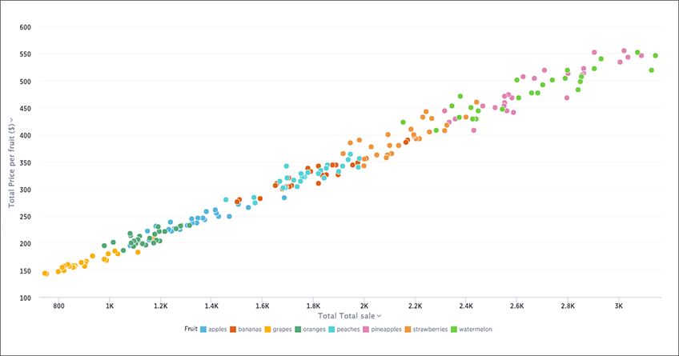

# Scatter charts

The scatter chart is useful for finding correlations or outliers in your data.

Scatter charts display your data as a collection of points, which can either be evenly or unevenly distributed. Each point is plotted based on its own axes values. This helps you determine if there is a relationship between your searched columns.

  

Your search needs at least one attribute and one measure to be represented as a scatter chart.

**Parent topic:** [About chart types](../../../pages/end_user_guide/end_user_search/about_chart_types.html)

