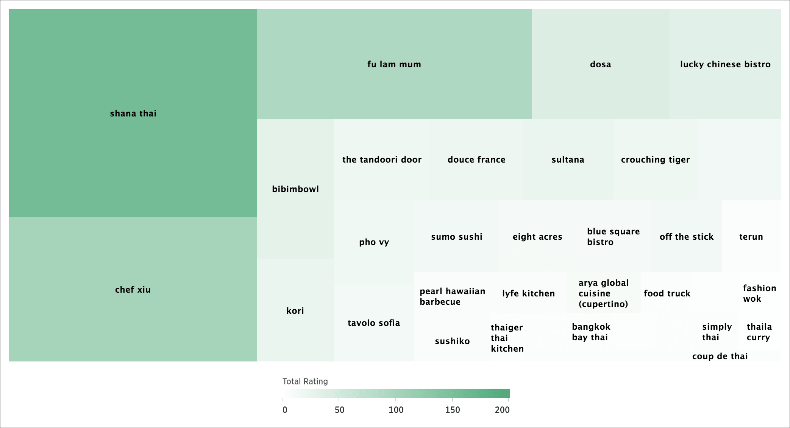
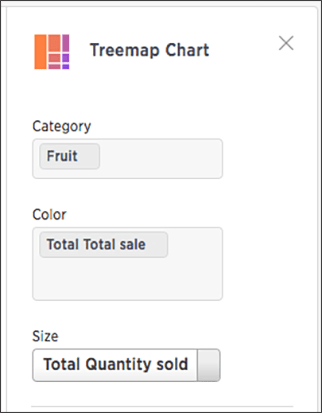

# Treemap charts

The treemap chart displays hierarchical data as a set of nested rectangles.

Treemap charts use color and rectangle size to represent two measure values. Each rectangle, or branch, is a value of the attribute. Some branches can contain smaller rectangles, or sub-branches. This setup makes it possible to display a large number of items in an efficient way.

  

You can rearrange the columns of your search into category, color, and size under **Edit chart configuration**.

  

Your search needs at least one attribute and two measures to be represented as a treemap chart.

**Parent topic:** [About chart types](../../../pages/end_user_guide/end_user_search/about_chart_types.html)

