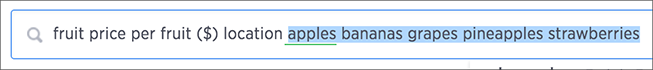

# Add a filter from the search bar

You can add a simple filter from the search bar while creating your answer.

To add a filter from the search bar:

1.   Click in the search bar and type the values you want to include in the search. Typing a value in the search bar acts as a filter. 

      

    You can also use filter keywords like yesterday, after, next month, 2016 to filter your search. To see more filter keywords, refer to the [keyword reference](../end_user_reference/keyword_reference.html#).

2.   Click outside of the search bar or push enter to apply your filter. 

**Parent topic:** [About simple filters](../../../admin/complex_searches/about_simple_filters.html)

