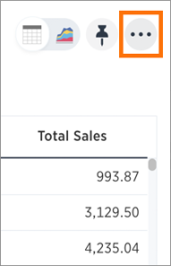
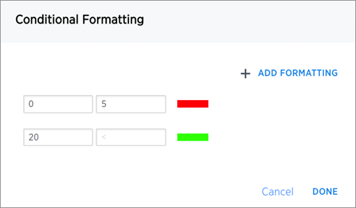
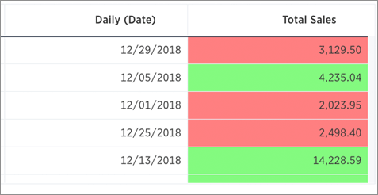
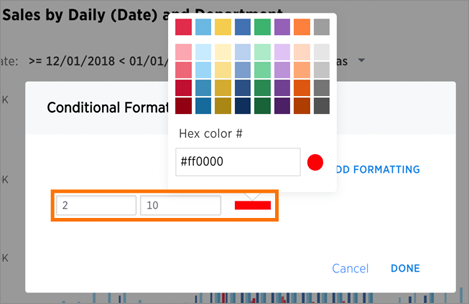

## Apply conditional formatting to a table

You can use conditional formatting to show table cells with a background color determined by the value they contain.

To apply conditional formatting to a table:

1.   In the column header of your table for the column you want to apply formatting to, click the three dot **Change Configuration** icon.

     

2.   Select **Conditional Formatting**.
3.   Click the **+** icon in the **Conditional Formatting** menu.

     

4.   Define the sets of values and the color to use for each set.

     

5. Click **Done** after defining all of your conditional formatting sets.

     

6.   Note that if you change to a chart type, you will need to apply conditional formatting again. Conditional formatting is tied to the specific visualization.

## Apply conditional formatting to a chart

You can use conditional formatting to show charts with a target value or range drawn as a line in the chart, and the legend colors determined by where values fall relative to the target.

To apply conditional formatting to a chart:

1.   Click the axis label of your chart. Select **Conditional Formatting**.
2.   Click the **+** icon in the Conditional Formatting menu.

     

3.   Define the ranges of values and the color to use for each range you want to track. To add another range, click the **+** icon and repeat.

     

4.   Click **Done** after defining all of your conditional formatting ranges.

     

5. Note that if you change the chart type, you will need to apply conditional formatting again. It is tied to the specific visualization.
