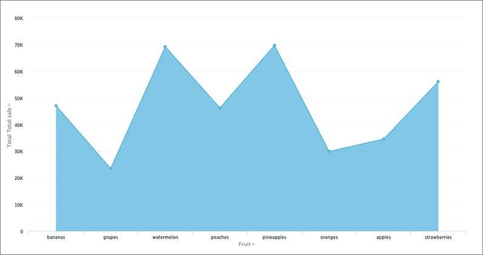

The area chart is based on the line chart, but has filled in regions.

## Area charts

Area charts display quantitative data graphically. The area between the x-axis and the line are colored in to help you compare different portions of the chart.

 

Your search needs at least one attribute and one measure to be represented as an area chart.

## Stacked area charts

The stacked area chart is an area chart with an attribute in the legend, which divides the area into layers.

Stacked area charts show the relative contribution to the accumulated total of a measure over time.

Stacked area charts plot the y-axis as a percentage by default. You can choose to toggle **Show Y-Axis as %** on or off in the **Configuration Options** to create your own mountain-style charts.

 

 

Your search needs at least two attributes and one measure to be represented as a stacked area chart.

**Parent topic:** [Area charts](../../../pages/end_user_guide/end_user_search/about_area_charts.html)
