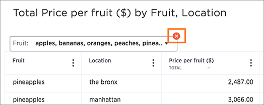

# Delete a filter

You can delete a filter from an answer to return to the original unfiltered search result.

There are multiple ways to delete a filter.

To delete a filter:

1.   Click the **x** on the filter term in the search bar. 

      

2.   You can also click the **x** on the filter bar above the answer. 

      

**Parent topic:** [About filters](../../../admin/complex_searches/about_filters.html)

