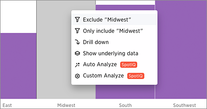

# Exclude and include row values

You can include or exclude row values from your answer.

To exclude or include row values:

1.   Right click on the visualization or table cell of interest, and select **Exclude "value"** or **Include "value"** if available. 

      

**Parent topic:** [Other search actions](../../../admin/complex_searches/search_actions.html)

