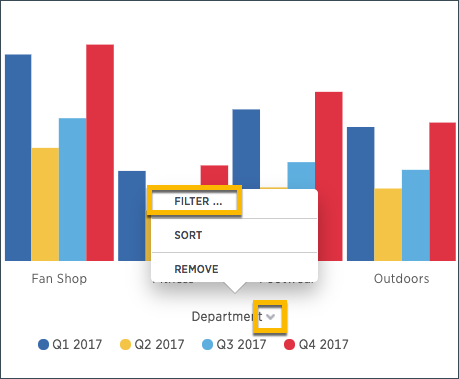
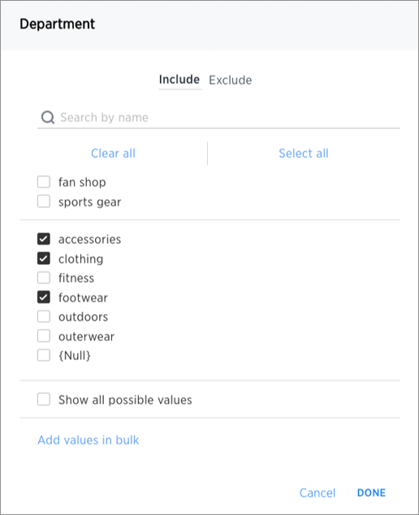

# Add a filter to a chart

You can add a simple filter from a chart axis while viewing your answer as a chart.

You can filter a chart in two ways:

1.  Click on the legend labels to toggle the values on or off.
2.  Follow the steps shown here to filter on the axis values.

To add a filter from the chart axes:

1.   While viewing your answer as a chart, click the chart axis you want to filter on, and select **Filter**. 

      

2.   Select the values you would like to include in your answer. Then click **Done**. 

      

**Parent topic:** [About simple filters](../../../admin/complex_searches/about_simple_filters.html)

