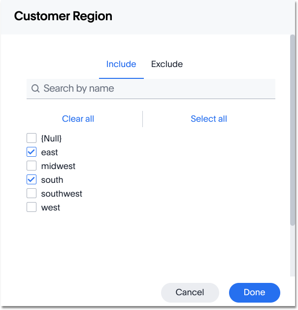

# Add a filter to a table

You can add a simple filter from a column header while viewing your answer as a table.

To add a filter from column headers:

1.   While viewing your answer as a table, click **Change configuration** on the column header you want to filter, and select **Filters**. 

      

2.   Select the values to include in your answer. Then click **Done**. If there are too many values, you can use the filter search bar to find the ones you want. 

      

**Parent topic:** [About simple filters](../../../admin/complex_searches/about_simple_filters.html)

