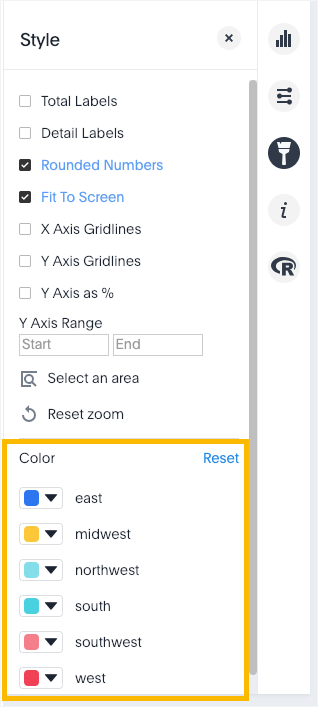

# Hide and show values

You can hide and show values on the chart using the legend.

Clicking on a legend item will hide it from the chart. You can click it again to show it.

To hide and show values:

1.   While viewing your answer as a chart, click **Edit chart configuration** on the right. 

      

2.   Make sure you have a column in the **Legend** field. 

      

3.   On the chart, click the legend value you would like to hide. Click the hidden legend value again to show it. 

      

    You can also click **only** next to a legend value to only show that value on the chart.

      

**Parent topic:** [Change the chart](../../../pages/end_user_guide/end_user_search/change_the_chart.html)

