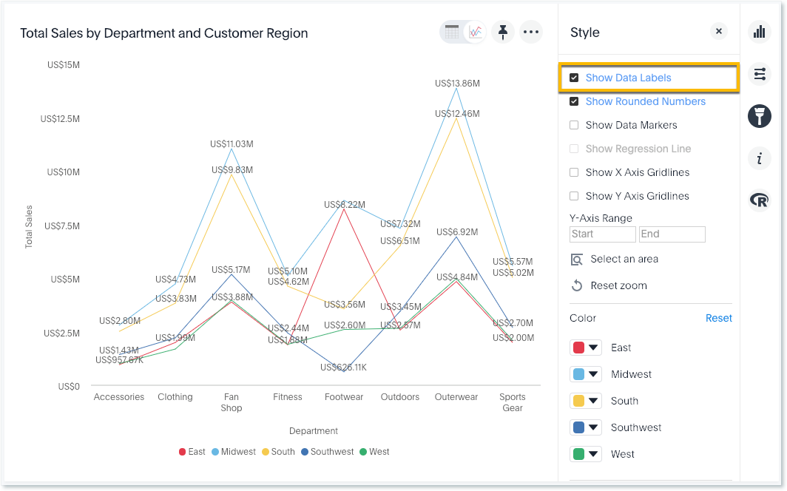

# Show data labels

You can configure charts to show the y-axis data values.

Some charts have additional options under **Configuration Options** that are covered in each chart type topic.

To show data labels:

1.   While viewing your answer as a chart, click **Edit chart configuration**. 

      

2.   Select **Show Data Labels**. 

      

**Parent topic:** [Change the chart](../../../pages/end_user_guide/end_user_search/change_the_chart.html)

