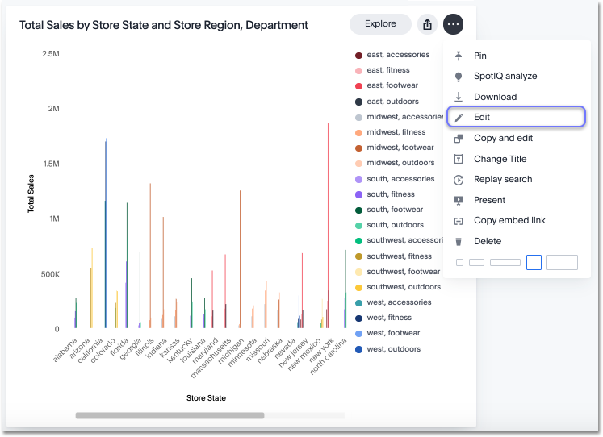

# Search actions within a pinboard

You can perform many of the same search actions on individual visualizations within a pinboard as you can within a search.

You can interact directly with a visualization of a pinboard to perform ad hoc searches or edit it. These search actions include the following:

-   Editing a search - You can edit the original search and reconfigure the answer. In the dropdown of a visualization, click **Edit**.

      

    You will be taken to an edit mode, where you can [view and change sources](../end_user_search/about_choosing_sources.html#), [search different columns](../end_user_search/about_the_search_bar.html#), [see the what am I looking at option](../end_user_search/what_am_i_looking_at_.html#), [change the view](../../complex_searches/change_the_view.html#), [save the answer as a worksheet](../../complex_searches/about_query_on_query.html), [add a formula](../../complex_searches/add_formula_to_search.html#), [change the table](../end_user_search/change_the_table.html#), and [change the chart](../end_user_search/change_the_chart.html#).

-   [Sorting](../../complex_searches/sort_your_search.html#)
-   [Changing the date bucketing](../end_user_search/change_the_date_bucketing.html#)
-   [Showing underlying data](../../complex_searches/show_underlying_data.html#)
-   [Drilling down](../../complex_searches/drill_down.html#)
-   [Excluding and including row values](../end_user_search/exclude_and_include_row_values.html#)
-   [Applying conditional formatting](../end_user_search/conditional_formatting_in_tables.html#)
-   [Filtering](../../complex_searches/about_filters.html#)
-   [Downloading the answer](../../complex_searches/download_your_search.html#)
-   [Replaying the search](../end_user_search/replay_search.html#)

**Parent topic:** [Other pinboard actions](../../../pages/end_user_guide/pinboards/pinboard_actions.html)

