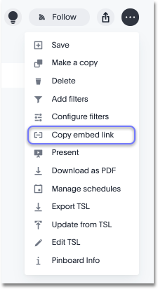
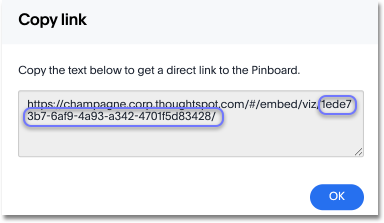
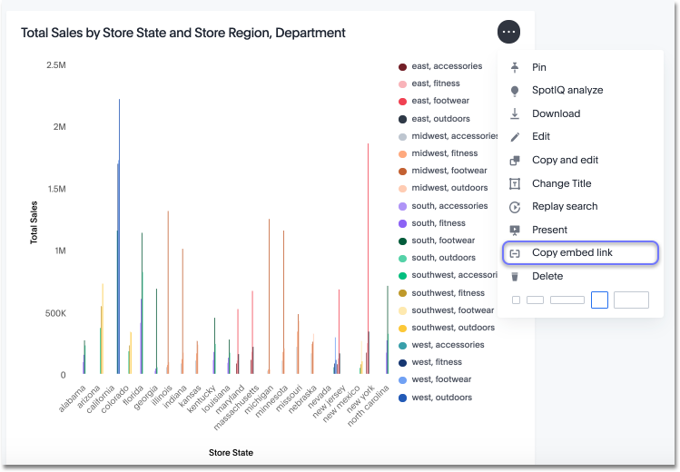
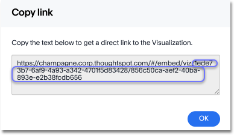

# Copy the link for a pinboard or visualization

In pinboards, there is a copy link ​option that lets you copy the link to access the pinboard and visualizations directly.

You can copy and paste the copied link to include in a presentation or spreadsheet, or email or Slack it to other people in your company. Note that when clicking the link, the person must be authenticated to ThoughtSpot to see the visualization (e.g. by logging in or LDAP).

You can also use this link for embedding the chart or table in another Web page, Web portal, or application when using the ThoughtSpot JavaScript API with Embedding or the REST API. For details, read the ThoughtSpot Application Integration Guide.

To copy the link for a pinboard:

1.   Click on **Pinboards**, on the top navigation bar. 

      

2.   On the pinboard list page, click the pinboard you would like to get a link for. 
3.   Click **Actions** and select **Copy link**. 

      

4.   Copy the pinboard link. The highlighted portion is the pinboard ID. 

      

5.   To copy an individual visualization link, click **Copy link** under the dropdown menu of the visualization you would like to get a link for. 

      

6.   Copy the visualization link. The highlighted portion is the visualization ID. 

      

**Parent topic:** [Other pinboard actions](../../../pages/end_user_guide/pinboards/pinboard_actions.html)

