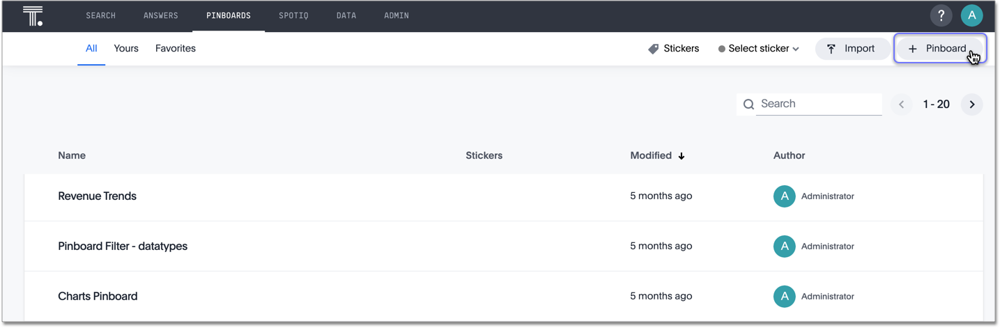
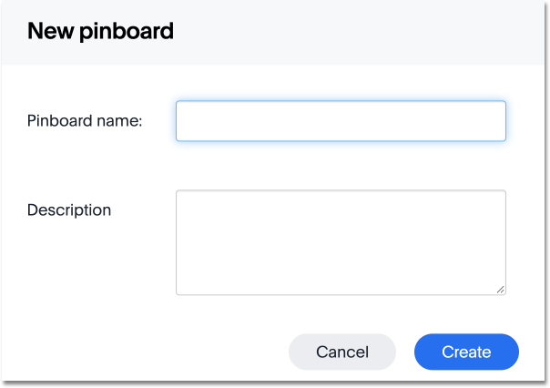

# Create a pinboard

Create a new pinboard to group and manage related search results.

You can also create a new pinboard when you [add an answer to a pinboard](add_an_answer_to_a_pinboard.html#).

To create a pinboard:

1.   Click on **Pinboards**, on the top navigation bar. 

      

2.   Click **+ New Pinboard** on the pinboards list page. 

      

3.   In the New Pinboard dialog box, give your pinboard a name and description. Then click **Create**. 

      

**Parent topic:** [About pinboards](../../../pages/end_user_guide/pinboards/about_pinboards.html)

