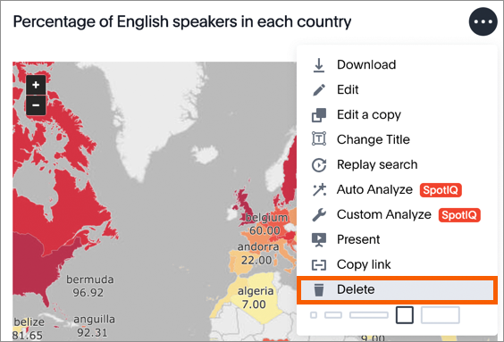

# Delete a visualization

You can remove a visualization from your pinboard.

To delete a visualization:

1.   Click on **Pinboards**, on the top navigation bar. 

      

2.   On the pinboard list page, click the pinboard you would like to edit. 
3.   Click **Delete** under the dropdown menu of the visualization you would like to delete. 

      

4.   Save your pinboard by clicking **Actions** and **Save**. 

      

**Parent topic:** [Other pinboard actions](../../../pages/end_user_guide/pinboards/pinboard_actions.html)

