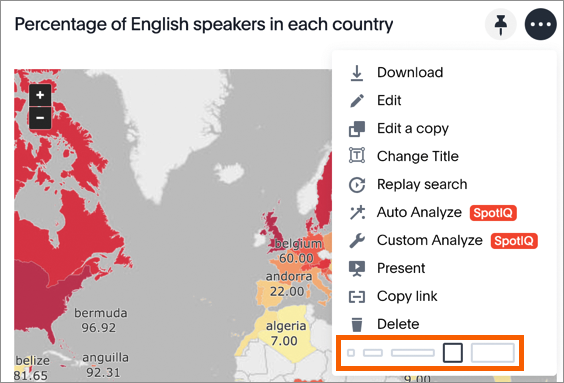

# Edit the layout of a pinboard

Editing the layout of a pinboard lets you snap visualizations into place, choose between set visualization sizes, and reset your layout.

Visualizations within a pinboard are easy to move around and snap into place on a relative flow layout. Your pinboard layout is also responsive to your browser resolution. This helps keep the layout of your pinboard neat and organized.

In addition, the size picker at the bottom of a visualization dropdown lets you toggle between predetermined sizes for each visualization. Charts and graphs can be toggled between a small, medium, and full width size, while headlines can be only one size (small). One row of the pinboard can hold a predetermined number of visualizations of each size.

1.   Click on **Pinboards**, on the top navigation bar. 

      

2.   On the pinboard list page, click the pinboard you would like to edit. 
3.   Resize your visualizations by choosing between the predetermined sizes under the visualization dropdown menu. 

      

4.   Drag and drop your visualizations on the layout grid to reorder your pinboard. 
5. If you are unhappy with your layout or you would like ThoughtSpot to configure your layout for you, go ahead and [reset your layout](reset_the_layout_of_a_pinboard.html#). 
6.   Save your pinboard by clicking **Actions** and **Save**. 

      

**Parent topic:** [About pinboards](../../../pages/end_user_guide/pinboards/about_pinboards.html)

