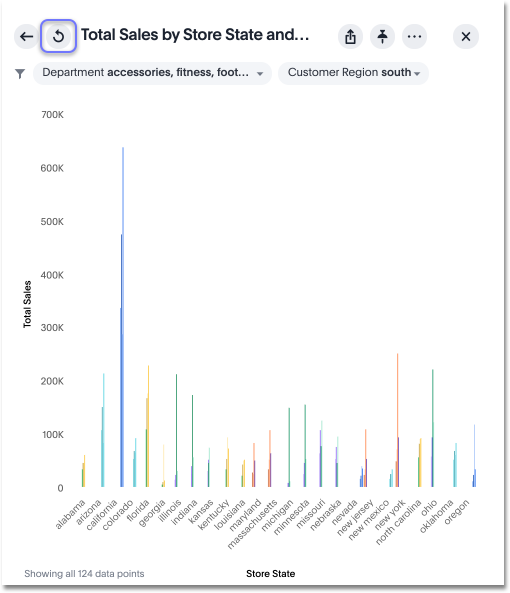

# Reset a visualization

Resetting a visualization removes any changes you've made to its form.

After performing ad hoc actions or edits to a visualization of your pinboard, you can reset the visualization to its original form.

To reset a visualization:

1.   On an altered visualization, click the reset icon. 

      

2.   Save your pinboard by clicking **Actions** and **Save**. 

      

**Parent topic:** [Other pinboard actions](../../../pages/end_user_guide/pinboards/pinboard_actions.html)

