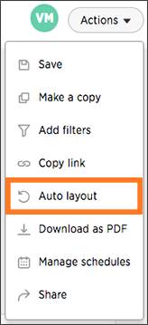

# Reset the layout of a pinboard

Reset the layout of a pinboard to undo your changes or have ThoughtSpot create a layout for you.

You can reset the layout of your pinboard if you would like to undo your edits or have ThoughtSpot optimize your layout space for you. This action will keep the sizes of your visualizations, but not the order.

To reset the layout of a pinboard:

1.   Click on **Pinboards**, on the top navigation bar. 

      

2.   On the pinboard list page, click the pinboard you would like to edit. 
3.   Click **Actions** and select **Auto layout**. 

      

4.   Save your pinboard by clicking **Actions** and **Save**. 

      

**Parent topic:** [Other pinboard actions](../../../pages/end_user_guide/pinboards/pinboard_actions.html)

